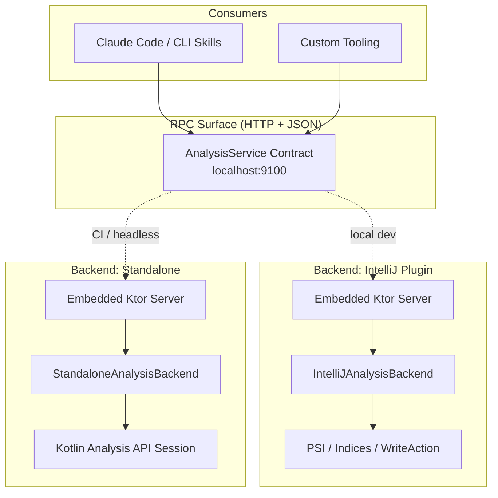
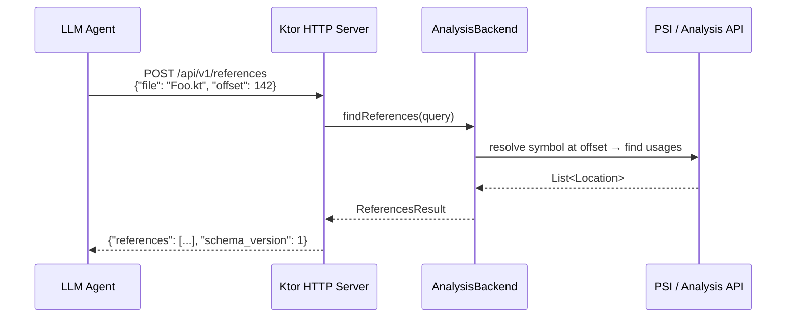

# ADR-001 Kast

> **Update 2026-04-01:** This ADR predates the CLI-only migration. The current
> repository retires `backend-intellij` and `analysis-common`; treat the
> dual-runtime sections below as historical context rather than current product
> behavior.

## Kotlin Analysis Server

**Context**: A hybrid analysis server exposing Kotlin semantic analysis (symbol resolution, references, call hierarchy, diagnostics, and mutations) over a backend-agnostic RPC surface. Two backend implementations: an IntelliJ plugin (parasitic on the running IDE's indices) for local development, and a Standalone Analysis API process for headless CI. The RPC contract is identical — consumers don't know or care which backend is answering.

**Constraints**:
- MCP is prohibited (enterprise restriction)
- Must run on developer Macs (Apple Silicon) and in CI (Linux containers)
- IntelliJ plugin must not freeze the IDE
- Standalone backend is experimental (Kotlin Analysis API Standalone is unsupported, subject to breaking changes)
- Fat JAR + wrapper script distribution (enterprise JVM fleet, no GraalVM)

**Inferences**:
- Target project is a large Spring multi-module Kotlin/Gradle codebase (~650 modules)
- Consumers are LLM tool-calling agents (Claude Code skills, CLI tooling) — not human IDE users
- JSON over HTTP is the natural wire format for this consumer profile
- First pass should prove the architecture with 4–5 operations, not attempt full LSP parity

---

## Architecture Overview

The system is a single RPC contract (`AnalysisService`) with two backend implementations that share nothing at runtime. A thin HTTP server (Ktor embedded) hosts the contract. In the IntelliJ plugin backend, Ktor starts inside the plugin's JVM and delegates to PSI/indices via `ReadAction`. In the standalone backend, Ktor starts in its own JVM process after initializing a Kotlin Analysis API session. Mutations are modeled as **text edits** (file + offset range + replacement text) at the RPC layer — this is the lowest common denominator that both backends can produce and apply, and it's the representation LLM agents actually need.

---

## Diagram





---

## Component Breakdown

| Component | Responsibility |
|-----------|---------------|
| `:analysis-api` | Pure Kotlin interfaces and data classes defining the RPC contract. Zero IntelliJ or Analysis API dependencies. |
| `:analysis-server` | Ktor embedded HTTP server. Routes requests to an `AnalysisBackend` implementation. Owns JSON serialization. |
| `:backend-intellij` | IntelliJ plugin implementing `AnalysisBackend` via PSI, indices, and refactoring APIs. Starts the server in-process. |
| `:backend-standalone` | Headless JVM app implementing `AnalysisBackend` via Kotlin Analysis API Standalone. Starts the server as `main()`. |
| `:shared-testing` | Test fixtures: fake backends, request/response builders, contract tests that run against any backend. |

---

## Project Structure

```
kotlin-analysis-server/
├── build-logic/
│   ├── settings.gradle.kts
│   ├── build.gradle.kts
│   └── src/main/kotlin/
│       ├── kas.kotlin-library.gradle.kts
│       └── kas.kotlin-app.gradle.kts
├── settings.gradle.kts
├── build.gradle.kts                          # Minimal — no allprojects/subprojects
├── gradle/
│   └── libs.versions.toml
├── analysis-api/
│   ├── build.gradle.kts                      # plugins { id("kas.kotlin-library") }
│   └── src/main/kotlin/
│       └── dev/kas/api/
│           ├── AnalysisBackend.kt            # The core interface
│           ├── model.kt                      # Data classes: Location, Symbol, TextEdit, etc.
│           └── capability.kt                 # BackendCapabilities sealed interface
├── analysis-server/
│   ├── build.gradle.kts                      # depends on :analysis-api, ktor-server
│   └── src/main/kotlin/
│       └── dev/kas/server/
│           ├── AnalysisServer.kt             # Ktor application setup
│           └── routes.kt                     # HTTP routes → backend dispatch
├── backend-intellij/
│   ├── build.gradle.kts                      # IntelliJ plugin + depends on :analysis-api, :analysis-server
│   └── src/main/kotlin/
│       └── dev/kas/intellij/
│           ├── IntelliJAnalysisBackend.kt    # PSI-based implementation
│           ├── IntelliJMutationHandler.kt    # WriteAction-based mutations
│           └── PluginStartup.kt             # Starts Ktor on IDE launch
├── backend-standalone/
│   ├── build.gradle.kts                      # depends on :analysis-api, :analysis-server, analysis-api-standalone
│   └── src/main/kotlin/
│       └── dev/kas/standalone/
│           ├── StandaloneAnalysisBackend.kt  # KAA-based implementation
│           ├── StandaloneMutationHandler.kt  # Text-level file edits
│           └── main.kt                       # Entry point: init session → start server
└── shared-testing/
    ├── build.gradle.kts
    └── src/main/kotlin/
        └── dev/kas/testing/
            ├── FakeAnalysisBackend.kt
            └── ContractTests.kt             # Runs the same assertions against any backend
```

### settings.gradle.kts (root)

```kotlin
pluginManagement {
    includeBuild("build-logic")
    repositories {
        gradlePluginPortal()
        mavenCentral()
    }
}

dependencyResolutionManagement {
    repositories {
        mavenCentral()
        maven("https://packages.jetbrains.team/maven/p/ij/intellij-dependencies")
    }
}

rootProject.name = "kotlin-analysis-server"

include(
    ":analysis-api",
    ":analysis-server",
    ":backend-intellij",
    ":backend-standalone",
    ":shared-testing",
)
```

---

## Interface Contracts

### AnalysisBackend — the seam

```kotlin
// :analysis-api

interface AnalysisBackend {
    /** What this backend can do. Clients check before calling mutation operations. */
    fun capabilities(): BackendCapabilities

    // ── Read operations ──

    /** Resolve the symbol at a given file offset. */
    fun resolveSymbol(query: SymbolQuery): SymbolResult?

    /** Find all references to the symbol at a given file offset. */
    fun findReferences(query: ReferencesQuery): ReferencesResult

    /** Incoming/outgoing call hierarchy for a callable symbol. */
    fun callHierarchy(query: CallHierarchyQuery): CallHierarchyResult

    /** Diagnostics (errors, warnings) for a file or set of files. */
    fun diagnostics(query: DiagnosticsQuery): DiagnosticsResult

    // ── Mutation operations ──

    /** Rename a symbol across the project. Returns text edits to apply. */
    fun rename(query: RenameQuery): MutationResult

    /** Apply a set of text edits to files. */
    fun applyEdits(edits: List<TextEdit>): ApplyResult
}
```

### Model types

```kotlin
// :analysis-api — all data classes, no behavior

data class FilePosition(val filePath: String, val offset: Int)
data class FileRange(val filePath: String, val startOffset: Int, val endOffset: Int)

data class Location(
    val filePath: String,
    val startOffset: Int,
    val endOffset: Int,
    val startLine: Int,
    val startColumn: Int,
    val preview: String,           // surrounding line(s) for LLM context
)

data class Symbol(
    val fqName: String,
    val kind: SymbolKind,
    val location: Location,
    val type: String?,             // rendered type signature
    val containingDeclaration: String?,
)

enum class SymbolKind {
    CLASS, INTERFACE, OBJECT, FUNCTION, PROPERTY, CONSTRUCTOR,
    ENUM_ENTRY, TYPE_ALIAS, PACKAGE, PARAMETER, LOCAL_VARIABLE,
}

// ── Query types ──

data class SymbolQuery(val position: FilePosition)
data class ReferencesQuery(val position: FilePosition, val includeDeclaration: Boolean = false)
data class CallHierarchyQuery(
    val position: FilePosition,
    val direction: CallDirection,
    val depth: Int = 3,
)
enum class CallDirection { INCOMING, OUTGOING }
data class DiagnosticsQuery(val filePaths: List<String>)

// ── Result types ──

data class SymbolResult(val symbol: Symbol, val schemaVersion: Int = 1)

data class ReferencesResult(
    val declaration: Symbol?,
    val references: List<Location>,
    val schemaVersion: Int = 1,
)

data class CallHierarchyResult(
    val root: CallNode,
    val schemaVersion: Int = 1,
)
data class CallNode(
    val symbol: Symbol,
    val children: List<CallNode>,
)

data class DiagnosticsResult(
    val diagnostics: List<Diagnostic>,
    val schemaVersion: Int = 1,
)
data class Diagnostic(
    val location: Location,
    val severity: DiagnosticSeverity,
    val message: String,
    val code: String?,
)
enum class DiagnosticSeverity { ERROR, WARNING, INFO }

// ── Mutation types ──

data class RenameQuery(val position: FilePosition, val newName: String, val dryRun: Boolean = true)

data class TextEdit(
    val filePath: String,
    val startOffset: Int,
    val endOffset: Int,
    val newText: String,
)

sealed interface MutationResult {
    /** Edits computed but not yet applied (dry-run default). */
    data class Planned(val edits: List<TextEdit>, val affectedFiles: List<String>) : MutationResult
    /** Edits applied to disk. */
    data class Applied(val edits: List<TextEdit>, val affectedFiles: List<String>) : MutationResult
    /** Operation not supported by this backend. */
    data class Unsupported(val reason: String) : MutationResult
    /** Operation failed. */
    data class Failed(val reason: String, val partial: List<TextEdit> = emptyList()) : MutationResult
}

data class ApplyResult(
    val applied: List<TextEdit>,
    val failed: List<TextEdit>,
    val errors: List<String>,
)

// ── Capability negotiation ──

data class BackendCapabilities(
    val name: String,                          // "intellij" | "standalone"
    val read: Set<ReadCapability>,
    val mutation: Set<MutationCapability>,
)

enum class ReadCapability {
    RESOLVE_SYMBOL, FIND_REFERENCES, CALL_HIERARCHY, DIAGNOSTICS,
}

enum class MutationCapability {
    RENAME, APPLY_EDITS,
    // Future: EXTRACT_METHOD, CHANGE_SIGNATURE, INLINE, SAFE_DELETE
}
```

### HTTP Routes

```
GET  /api/v1/capabilities              → BackendCapabilities
POST /api/v1/symbol/resolve             → SymbolResult
POST /api/v1/references                 → ReferencesResult
POST /api/v1/call-hierarchy             → CallHierarchyResult
POST /api/v1/diagnostics                → DiagnosticsResult
POST /api/v1/rename                     → MutationResult
POST /api/v1/edits/apply                → ApplyResult
GET  /api/v1/health                     → { "status": "ok", "backend": "intellij|standalone" }
```

All request/response bodies are JSON. Schema version is embedded in every result so clients can detect contract drift across tool versions.

---

## Mutation Feasibility Analysis

This is the crux of your question, so here's the detailed breakdown:

### IntelliJ Plugin Backend — Full mutation support

PSI mutation via `WriteAction` is a first-class IntelliJ API. The refactoring infrastructure (`RefactoringFactory`, `RenameRefactoring`, `RenameProcessor`) handles cross-file rename with full semantic awareness — including Kotlin-specific concerns like property accessor renaming, overrides, and `@JvmName` annotations. The plugin backend can:

1. **Rename**: Use `RenameProcessor` inside `WriteCommandAction`. This handles all transitive references, overrides, and string literals if configured. The processor returns a usage set that maps directly to `TextEdit` objects.
2. **Apply arbitrary text edits**: Use `Document.replaceString()` inside `WriteCommandAction`. The IDE's VFS refreshes automatically.
3. **Future refactorings** (extract method, inline, change signature): These all have IntelliJ API equivalents. Not free, but not architectural lifts — they're feature work once the plumbing exists.

The threading constraint is real: all PSI reads need `ReadAction`, all writes need `WriteCommandAction.runWriteCommandAction()`, and you want `ReadAction.nonBlocking` for anything expensive to avoid freezing the UI. This is standard plugin engineering.

### Standalone Backend — Text-edit mutations only

The Kotlin Analysis API Standalone is a read-only analysis engine. It builds PSI trees and resolves symbols, but it was not designed for mutation. There is no `WriteAction` infrastructure, no refactoring processors, no VFS write support.

What you *can* do: use the analysis engine to **compute** what edits are needed, then apply them as plain text file I/O. For rename specifically:

1. Resolve the symbol at the target offset (AA can do this)
2. Find all references to that symbol (AA can do this — `KaSession.useSiteSymbol()` and reference search)
3. Compute text edits: for each reference location, produce a `TextEdit` replacing the old name with the new name
4. Write the edits to disk as file I/O (trivial)

This works for rename. It does *not* work for complex refactorings (extract method, change signature, inline) because those require PSI tree manipulation to produce correct output — you'd be reimplementing the refactoring engine from scratch.

### The contract handles this cleanly

The `BackendCapabilities` response tells the client exactly what's available:

```json5
// IntelliJ backend
{
  "name": "intellij",
  "read": ["RESOLVE_SYMBOL", "FIND_REFERENCES", "CALL_HIERARCHY", "DIAGNOSTICS"],
  "mutation": ["RENAME", "APPLY_EDITS"]
}

// Standalone backend
{
  "name": "standalone",
  "read": ["RESOLVE_SYMBOL", "FIND_REFERENCES", "CALL_HIERARCHY", "DIAGNOSTICS"],
  "mutation": ["RENAME", "APPLY_EDITS"]
}
```

Both backends support rename in the first pass. The IntelliJ backend's rename is semantically richer (handles overrides, `@JvmName`, KDoc references). The standalone backend's rename is text-match-based informed by analysis (handles the 90% case). The `dryRun: true` default means the LLM agent sees the planned edits before committing — it can review and decide.

When the IntelliJ backend eventually supports `EXTRACT_METHOD` and the standalone backend doesn't, the capabilities diverge explicitly and the consumer adapts.

---

## ADRs
See [docs/](docs/) for ADR's, identified sequentially 
