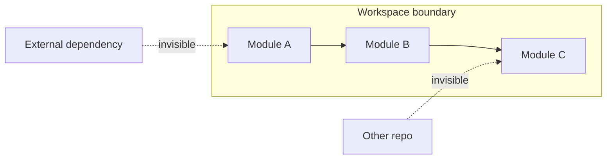

# Behavioral model

Kast is most useful when you know how to read its boundaries. This page
explains the behavioral rules behind every major result type so you can
tell the difference between "there is no result," "the workspace can't
see that code," and "Kast stopped on purpose."

## Everything is workspace-scoped

Kast attaches one daemon to one workspace root and builds one analysis
session for that workspace. References, call hierarchy, diagnostics,
and edit plans only cover files inside that session.

If code lives outside the workspace root or outside the discovered
source roots, Kast doesn't include it in results. Standard library
calls and external dependency usages don't appear as tree edges.

## Call hierarchy is intentionally bounded

Call hierarchy results are bounded by configurable depth, fan-out, total
edge, and timeout limits. Every truncated node carries a reason, and
`stats` reports which bounds were hit.
[Full truncation model →](../what-can-kast-do/trace-usage.md#how-truncation-works)

## Entry points have no incoming callers

Some functions are genuine entry points even when Kast returns zero
incoming callers. `main` functions, test methods, framework callbacks,
and public APIs called from outside the workspace all fit that pattern.
"No incoming callers" means "no callers visible inside this workspace."

## Symbol resolution is position-based

Kast resolves the symbol at a specific file offset. It doesn't start
from a simple name. Two classes with the same name are distinct if they
are different declarations in different files or packages. Position
beats text matching when identity matters.

!!! tip
    If you don't have an offset, use `workspace-symbol` to find
    declarations by name, then feed the result's `filePath` and
    `startOffset` into `resolve`.

## Reference search is visibility-scoped

Kast narrows reference searches based on Kotlin visibility rules and
reports exhaustiveness via `searchScope`. Always read
`searchScope.exhaustive` before claiming a reference list is complete.
[Full scoping model →](../what-can-kast-do/trace-usage.md#how-visibility-drives-scope)

## File outline shows named declarations only

The `outline` command returns a nested tree of named declarations in a
file: classes, objects, named functions, and named properties. It
excludes function parameters, anonymous elements (lambdas, object
literals), and local declarations inside function bodies.

Use outline results as a structural overview, not a complete list of
every identifier.

## Workspace symbol search is name-based

`workspace-symbol` finds declarations by name across every file in the
workspace. The default is a case-insensitive substring match.

- `--pattern=Check` matches `HealthCheckService`, `checkInventory`,
  and `runChecks`
- Pass `--regex=true` for pattern-based matching
- Results are capped by the requested limit (default 100)
- Read `page.truncated` before treating results as complete

Workspace symbol results include metadata (name, kind, file path,
location) but are not the same as a `resolve` result. Always follow up
with `resolve` when you need the full symbol identity.

## Rename plans use hash-based conflict detection

Rename returns edits together with `fileHashes` — SHA-256 snapshots of
the files Kast expects to change. When you apply the plan, Kast
recomputes the current hashes and rejects the apply if a file changed.

Treat `fileHashes` as part of the contract. Don't modify them by hand.

## The daemon refreshes automatically

Kast keeps workspace state fresh without requiring manual restarts:

- `apply-edits` writes changes, then refreshes affected files (or the
  full workspace when file creation or deletion changed the layout)
- A background watcher batches `.kt` file events under registered
  source roots and refreshes the session automatically
- `workspace refresh` exists as a manual recovery path

## Next steps

- [Kast vs LSP](kast-vs-lsp.md) — why Kast exists alongside the
  Language Server Protocol
- [Troubleshooting](../troubleshooting.md) — common problems and fixes
