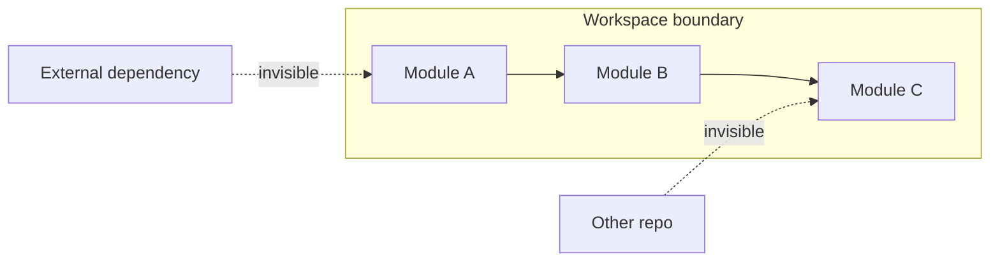

# Limits and boundaries

!!! note "When to read this page"

    Read this when a `kast` result looks off and you need to know
    *why* — why a reference list is shorter than you expected, why
    a call hierarchy stops at depth 3, why an edit plan rejected
    your apply. Not required for everyday use.

`kast` is most useful when you can read its boundaries. This page
covers the rules behind every major result type so you can tell
"there is no result" from "the workspace can't see that code" from
"`kast` stopped on purpose."

## Everything is workspace-scoped

One daemon, one workspace root, one analysis session. References,
call hierarchy, diagnostics, and edit plans only cover files inside
that session.

If code lives outside the workspace root or outside the discovered
source roots, `kast` won't include it in results. Standard library
calls and external dependency usages don't appear as tree edges.

## Call hierarchy is intentionally bounded

Call hierarchy is bounded by configurable depth, fan-out, total
edge, and timeout limits. Every truncated node carries a reason,
and `stats` reports which bounds were hit.
[Full truncation model →](../what-can-kast-do/trace-usage.md#how-truncation-works)

## Entry points have no incoming callers

Some functions are real entry points even when `kast` returns zero
incoming callers. `main` functions, test methods, framework
callbacks, and public APIs called from outside the workspace all
fit that pattern. "No incoming callers" means "no callers visible
inside this workspace."

## Symbol resolution is position-based

`kast` resolves the symbol at a specific file offset — not from a
plain name. Two classes with the same name are distinct if they're
different declarations in different files or packages. Position
beats text matching when identity matters.

!!! tip
    No offset? Use `workspace-symbol` to find declarations by
    name, then feed the result's `filePath` and `startOffset` into
    `resolve`.

## Reference search is visibility-scoped

`kast` narrows reference searches based on Kotlin visibility rules
and reports exhaustiveness via `searchScope`. Always read
`searchScope.exhaustive` before claiming a reference list is
complete.
[Full scoping model →](../what-can-kast-do/trace-usage.md#how-visibility-drives-scope)

## File outline shows named declarations only

`outline` returns a nested tree of named declarations in a file:
classes, objects, named functions, named properties. It excludes
function parameters, anonymous elements (lambdas, object literals),
and local declarations inside function bodies.

Treat outline as a structural overview, not a complete list of
every identifier.

## Workspace symbol search is name-based

`workspace-symbol` finds declarations by name across every file in
the workspace. Default is case-insensitive substring match.

- `--pattern=Check` matches `HealthCheckService`, `checkInventory`,
  and `runChecks`
- Pass `--regex=true` for pattern-based matching
- Results are capped by the requested limit (default 100)
- Read `page.truncated` before treating results as complete

Workspace symbol results include metadata (name, kind, file path,
location) but aren't a `resolve` result. Follow up with `resolve`
when you need full symbol identity.

## Rename plans use hash-based conflict detection

Rename returns edits together with `fileHashes` — SHA-256 snapshots
of the files `kast` expects to change. When you apply the plan,
`kast` recomputes the current hashes and rejects the apply if any
file changed.

Treat `fileHashes` as part of the contract. Don't modify them by
hand.

## The daemon refreshes automatically

State stays fresh without manual restarts:

- `apply-edits` writes changes, then refreshes affected files (or
  the full workspace when file creation or deletion changed the
  layout)
- A background watcher batches `.kt` file events under registered
  source roots and refreshes the session
- `workspace refresh` exists as a manual recovery path

## Next steps

- [Kast vs LSP](kast-vs-lsp.md) — why `kast` exists alongside LSP
- [Troubleshooting](../troubleshooting.md) — common problems and
  fixes
