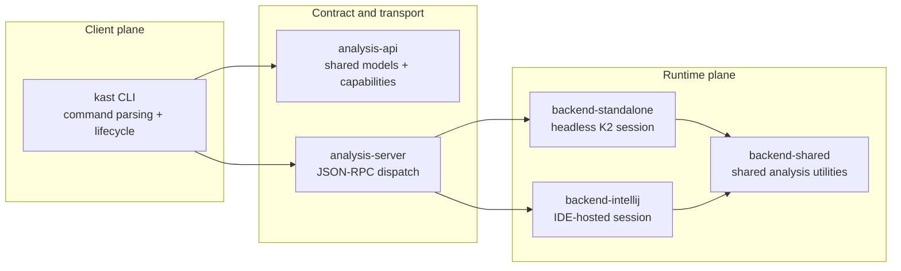
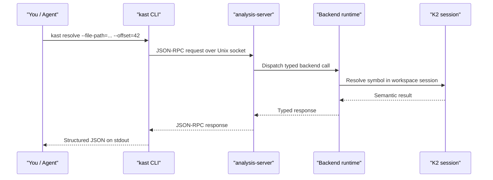
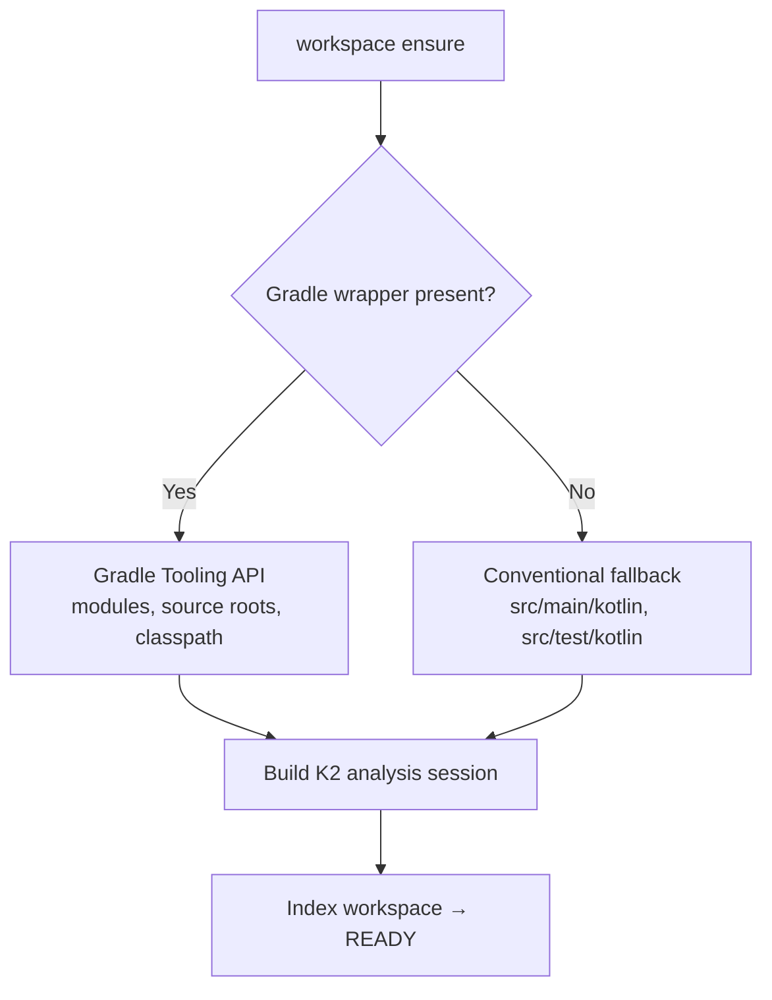

# How Kast works

!!! note "You don't need to read this to use kast"

    This is a deep dive: modules, request flow, daemon lifecycle,
    why decisions came out the way they did. It exists for
    contributors and for anyone hitting a behavior they want to
    understand from first principles. If you're trying to *do*
    something, start with the
    [Quickstart](../getting-started/quickstart.md) or jump to
    [Recipes](../recipes.md).

This page explains the architecture: what each module owns, how a
request flows from your terminal to the K2 engine and back, and why
the system is shaped this way. It also covers how `kast` runs
either on its own or piggybacks on a warm IntelliJ session, exposing
the same protocol surface either way.

## High-level architecture

`kast` is a client-daemon design with a shared contract and two
runtime modes. The CLI is a thin control plane. The backend keeps
Kotlin semantic state warm across requests.

The core decision: isolate semantic runtime cost in long-lived
backends so repeat queries reuse session state instead of
rebuilding compiler context on every command.

## One protocol, two runtime modes

The JSON-RPC contract stays stable. The runtime that holds
semantic state is the part that swaps. Both backends expose the
same method surface, the same capability reporting, the same result
shapes. The practical difference: where the warm Kotlin state
lives.

| Runtime mode | Where semantic state lives | Who keeps it warm | Best fit |
|---|---|---|---|
| Standalone | A standalone daemon process with its own analysis session and caches | `kast` workspace lifecycle | Terminals, CI, remote machines, cloud agents |
| IntelliJ plugin | An already-open IntelliJ project, reusing the IDE's project model, PSI, and indexes | IntelliJ project lifecycle | Local tools when the IDE is already open |

If IntelliJ is warm, external tools connect to the plugin backend
and inherit that state for free. If no IDE is running, the
standalone backend exposes the same surface independently.

## Module ownership

??? info "Module ownership table (for contributors)"

    Each module has a clear boundary. Changes belong in the narrowest
    module that owns the behavior.

    | Module | Owns | Why it exists |
    |--------|------|---------------|
    | `analysis-api` | Shared contract, serializable models, capability flags, edit validation | Keeps protocol semantics stable across all consumers |
    | `kast-cli` | Command parsing, lifecycle orchestration, native entrypoint, distribution | Centralizes user-facing workflows |
    | `analysis-server` | JSON-RPC transport, dispatch, descriptor lifecycle | Isolates transport concerns from semantic logic |
    | `backend-standalone` | Headless runtime, workspace discovery, K2 session bootstrap | Concentrates stateful analysis in one runtime |
    | `backend-intellij` | IDE-hosted runtime, plugin lifecycle, project service | Reuses IntelliJ project model when IDE is running |
    | `backend-shared` | Shared analysis helpers for both runtimes | Avoids duplicate semantic utility code |
    | `shared-testing` | Contract fixtures and fake backend infrastructure | Pins behavior consistency across implementations |
    | `build-logic` | Gradle conventions, wrapper generation, runtime-lib sync | Keeps build and packaging rules centralized |

## End-to-end request flow

This sequence walks one command from terminal to engine and back.

Every step returns structured data. No string scraping. No regex
parsing. Anywhere.

In standalone mode, "Backend runtime" is the standalone daemon and
its own analysis session. In IntelliJ mode, it's the plugin service
inside IntelliJ — same transport, but answering from the IDE's
warm project state.

## Why a daemon?

Starting a Kotlin analysis session is the expensive part:
discovering the workspace, resolving classpaths, building compiler
indexes. `kast` pays that cost once per workspace and keeps the
session warm.

- **First command is slower** — workspace discovery, session
  startup, initial indexing all happen up front
- **Later commands are fast** — the backend reuses loaded state
- **One long-lived host owns the analysis context** — caches and
  indexes stay with the workspace until the host stops

In standalone mode, that host is the `kast` daemon. In IntelliJ
mode, it's IntelliJ itself. The plugin starts the `kast` server as
part of the IDE lifecycle, so external tools piggyback on the IDE's
already-open project model, indexes, and analysis session instead
of bringing up a second warm session.

## Why two runtimes?

Same protocol, two operating environments.

- **Standalone favors independence** — works without any IDE, so
  the same semantic operations run in terminals, CI jobs, remote
  machines, and cloud agents
- **IntelliJ plugin favors reuse** — lets external tools tap into
  an IDE session that's already open, indexed, and ready

The split keeps the contract stable for clients while letting the
semantic state live wherever the workflow already keeps it.

## Design decisions

These choices shape everyday behavior. Knowing them helps you
predict what `kast` will and won't do.

### JSON-RPC contract as the stable center

The wire protocol is explicit and capability-gated. Clients check
`capabilities` before assuming an operation exists. That keeps the
contract honest and stops backends from advertising work they can't
do.

### Bounded traversals

Operations like `call-hierarchy` are bounded on purpose: depth,
fan-out, total edges, time. Every result carries truncation
metadata so callers can tell "the tree is complete" from "`kast`
stopped on purpose."

### Planned mutation over blind rewrite

Rename and edit application use plan-and-apply with SHA-256 file
hashes. You plan, review, apply. If any file changed in between,
`kast` rejects the apply with a clear conflict error. Stale plans
can't slip through.

### Workspace-scoped analysis

One daemon, one workspace root, one analysis session. All results
— references, call hierarchy, diagnostics, edits — are scoped to
files inside that session. Code outside the root is invisible.

## Workspace discovery

How the daemon finds your project depends on what's there.

Gradle projects use the Tooling API for full visibility into
multi-module layouts. Everything else falls back to conventional
source roots.

## Command tiers

Every CLI command is documented in the
[CLI cheat sheet](../cli-cheat-sheet.md), which also explains the
two-tier organization: a primary path of everyday commands and a
set of advanced primitives for expert workflows and agent
automation.

## Next steps

- [Backends](../getting-started/backends.md) — pick between the
  standalone daemon and the IntelliJ plugin
- [Limits and boundaries](behavioral-model.md) — the rules and
  limits behind `kast` results
- [Kast vs LSP](kast-vs-lsp.md) — why `kast` exists alongside LSP
