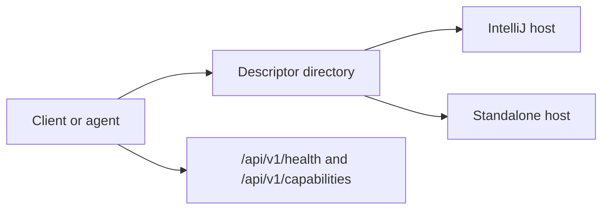

Kast exposes the same HTTP/JSON contract through two runtime hosts. This page
helps you decide which host to start, what each one needs from your workspace,
and how to keep one client flow across both.

<div class="grid cards" markdown>

-   **Use the IntelliJ host**

    Start Kast from a plugin-enabled IDE when you want analysis to run against
    the workspace currently loaded in IntelliJ.

    [Go to IntelliJ startup](#use-the-intellij-host)

-   **Use the standalone host**

    Start Kast as a headless JVM process when you need CI, scripts, or another
    environment without a running IDE.

    [Go to standalone startup](#use-the-standalone-host)

-   **Use both with one client**

    Keep discovery and request handling identical, then select the runtime from
    the descriptor file at connection time.

    [Go to shared client flow](#use-both-with-one-client-flow)

</div>

## Compare the hosts

Both hosts write the same descriptor shape and serve the same route map. The
main difference is where analysis runs and how the workspace gets loaded.

| Question | IntelliJ host | Standalone host |
| --- | --- | --- |
| Where it runs | Inside the IntelliJ process for one open project | In its own JVM process |
| How it starts | Open a project in the plugin-enabled IDE | Launch the wrapper script or fat JAR |
| Workspace source | The project already opened in IntelliJ | `--workspace-root` or `KAST_WORKSPACE_ROOT` |
| Source discovery | Uses the IDE project model, PSI, and indices | Scans conventional source roots and auto-discovers Gradle modules when available |
| Default bind | `127.0.0.1` on an ephemeral port | `127.0.0.1` on an ephemeral port |
| Descriptor field | `backendName = "intellij"` | `backendName = "standalone"` |
| Current production capabilities | `RESOLVE_SYMBOL`, `FIND_REFERENCES`, `DIAGNOSTICS`, `RENAME`, `APPLY_EDITS` | `RESOLVE_SYMBOL`, `FIND_REFERENCES`, `DIAGNOSTICS`, `RENAME`, `APPLY_EDITS` |
| Common use case | Local development with a live IDE project | CI, automation, and headless workflows |

## Use the IntelliJ host

Use the IntelliJ host when your workspace is already open in IntelliJ and you
want Kast to start from that project context.

1. Build the plugin from the repo root.

   ```bash
   ./gradlew :backend-intellij:buildPlugin
   ```

2. Start the sandbox IDE.

   ```bash
   ./gradlew :backend-intellij:runIde
   ```

3. Open the workspace you want Kast to serve.

4. Wait for the project-scoped service to start and write a descriptor under
   `~/.kast/instances/`, or under `KAST_INSTANCE_DIR` if you set that
   environment variable first.

5. Read the descriptor and connect to the advertised `host` and `port`.

> **Note:** The IntelliJ host starts one Kast server per open workspace. It
> binds to `127.0.0.1`, picks an ephemeral port, and uses fixed startup limits
> of `maxResults = 500`, `requestTimeoutMillis = 30000`, and
> `maxConcurrentRequests = 4`.

## Use the standalone host

Use the standalone host when you need Kast outside IntelliJ, or when you want
to wire it into CI and scripts.

1. Build the standalone distribution from the repo root.

   ```bash
   ./gradlew :backend-standalone:fatJar \
     :backend-standalone:writeWrapperScript
   ```

2. Start the wrapper script with an absolute workspace path.

   ```bash
   ./backend-standalone/build/scripts/backend-standalone \
     --workspace-root=/absolute/path/to/workspace
   ```

3. Add overrides only when the default discovery path is not enough.

   - Use `--source-roots` to replace automatic source-root discovery.
   - Use `--classpath` to add absolute classpath entries.
   - Use `--module-name` when you supply manual source roots.
   - Use `--token` or `KAST_TOKEN` when you want protected routes.

4. Read the descriptor file and connect to the advertised `host` and `port`.

> **Warning:** If you bind the standalone host to a non-loopback address, you
> must also set a non-empty token. Kast rejects non-local binding without a
> token.

## Use both with one client flow

Kast is easier to integrate when your client treats the runtime host as a
discovery result instead of a hardcoded mode.



Use this flow when you want the same client to work in local development and
headless environments.

1. Read descriptor files from `~/.kast/instances/`, or from `KAST_INSTANCE_DIR`
   when you override the location.
2. Select the descriptor that matches the target `workspaceRoot`, or filter by
   `backendName` if you need one specific host.
3. Call `/api/v1/health` to confirm the runtime identity.
4. Call `/api/v1/capabilities` and gate optional routes against the returned
   capabilities.
5. Send the same request shapes regardless of which host answered.

## Enable standalone usage in CI or scripts

The standalone host fits automated environments because it does not depend on a
running IDE. A minimal bootstrap looks like this.

```bash
./gradlew :backend-standalone:fatJar \
  :backend-standalone:writeWrapperScript

export KAST_INSTANCE_DIR="$PWD/.kast-instances"
export KAST_TOKEN="ci-shared-secret"

./backend-standalone/build/scripts/backend-standalone \
  --workspace-root="$PWD" \
  --token="$KAST_TOKEN"
```

If your automation already knows the workspace root, you can set
`KAST_WORKSPACE_ROOT` instead of passing `--workspace-root`.

## Verify the runtime you started

The startup path is complete when discovery and capability checks agree with
the host you intended to use.

- A descriptor file exists in the expected instance directory.
- The descriptor reports the expected `workspaceRoot` and `backendName`.
- `/api/v1/health` returns `status: "ok"`.
- `/api/v1/capabilities` advertises the routes your client plans to call.

## Next steps

Read [Get started](get-started.md) for the first-request walkthrough. Use
[Operator guide](operator-guide.md) when you need CLI flags, descriptor
lifecycle details, or runtime defaults. Keep [HTTP API](api-reference.md)
open when you are wiring a client against the contract.
