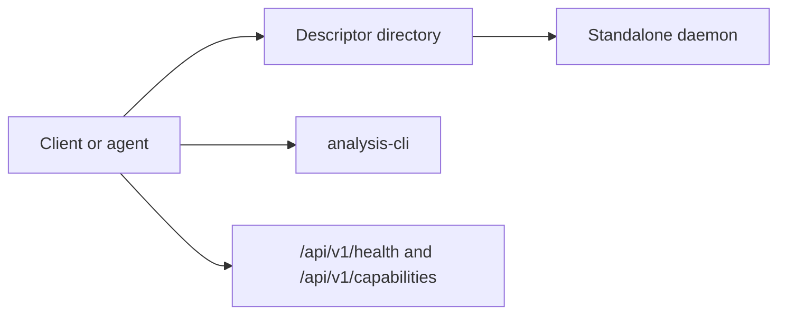

Kast now supports one runtime and two operator surfaces: the repo-local CLI is
the supported control plane, and direct HTTP to the standalone daemon remains
available once that daemon is already running. This page explains when to use
each surface and how discovery still works.

<div class="grid cards" markdown>

-   **Use the CLI control plane**

    Use the repo-local CLI for the normal supported workflow.

    [Go to CLI usage](#use-the-cli-control-plane)

-   **Use direct standalone HTTP**

    Use this only when a workspace runtime already exists and you need the raw
    HTTP contract.

    [Go to direct HTTP usage](#use-direct-standalone-http)

-   **Keep one discovery flow**

    Keep descriptor lookup and capability checks identical whether you stay on
    the CLI or drop down to HTTP.

    [Go to discovery flow](#keep-one-discovery-flow)

</div>

## Compare the supported surfaces

Both surfaces target the same standalone runtime. The main difference is who is
responsible for daemon lifecycle, readiness checks, and descriptor handling.

| Question | Repo-local CLI | Direct standalone HTTP |
| --- | --- | --- |
| Starts a runtime when missing | Yes | No |
| Reads and validates descriptors | Yes | Caller must do it |
| Waits for readiness | Yes | Caller must do it |
| Primary use case | Agents, scripts, and operators in this repo | Low-level integrations after bootstrap |
| Supported backend | `standalone` | `standalone` |
| Current production capabilities | `RESOLVE_SYMBOL`, `FIND_REFERENCES`, `DIAGNOSTICS`, `RENAME`, `APPLY_EDITS` | Same daemon capabilities |

## Use the CLI control plane

Use the CLI when you want Kast to work correctly for a workspace without
managing descriptor files or process handles yourself.

1. Build the CLI from the repo root.

   ```bash
   ./gradlew :analysis-cli:fatJar :analysis-cli:writeWrapperScript
   ```

2. Ensure a runtime for the target workspace.

   ```bash
   ./analysis-cli/build/scripts/analysis-cli \
     workspace ensure \
     --workspace-root=/absolute/path/to/workspace
   ```

3. Run analysis commands through the same CLI.

   ```bash
   ./analysis-cli/build/scripts/analysis-cli \
     diagnostics \
     --workspace-root=/absolute/path/to/workspace \
     --request-file=/absolute/path/to/query.json
   ```

4. Use `workspace status`, `daemon start`, and `daemon stop` when you need
   explicit lifecycle control.

## Use direct standalone HTTP

Use direct HTTP only when a standalone runtime already exists and you want the
raw route surface instead of the CLI wrapper.

1. Get the selected runtime metadata from `workspace status` or by reading the
   descriptor file directly.

2. Call `/api/v1/health` or `/api/v1/capabilities` first.

   ```bash
   curl http://127.0.0.1:51234/api/v1/capabilities
   ```

3. Send the normal JSON request bodies once the runtime is confirmed ready.

   ```bash
   curl \
     -X POST http://127.0.0.1:51234/api/v1/diagnostics \
     -H 'Content-Type: application/json' \
     -d '{"filePaths":["/absolute/path/to/workspace/src/main/kotlin/example/Foo.kt"]}'
   ```

The runtime is still the same standalone daemon the CLI would use; direct HTTP
just means you are taking over readiness and descriptor handling yourself.

## Keep one discovery flow

Kast is easiest to integrate when the runtime is treated as a discovery result
instead of a hardcoded local endpoint.



1. Read descriptor files from `<workspace>/.kast/instances/`, or from
   `KAST_INSTANCE_DIR` when you override the location.
2. Select the descriptor that matches the target `workspaceRoot` and the sole
   supported backend, `standalone`.
3. Call `/api/v1/health` to confirm the runtime identity.
4. Call `/api/v1/capabilities` and gate optional routes against the returned
   capabilities.
5. Either keep using the CLI or send the same HTTP request shapes directly.

## Verify the runtime you started

The startup path is complete when discovery and capability checks agree with the
standalone runtime you intended to use.

- A descriptor file exists in the expected instance directory.
- The descriptor reports the expected `workspaceRoot` and `backendName = "standalone"`.
- `/api/v1/health` returns `status: "ok"`.
- `/api/v1/capabilities` advertises the routes your client plans to call.

## Next steps

Read [Get started](get-started.md) for the first-request walkthrough. Use
[Operator guide](operator-guide.md) when you need CLI commands, descriptor
lifecycle details, or runtime defaults. Keep [HTTP API](api-reference.md)
open when you are wiring a client against the contract.
