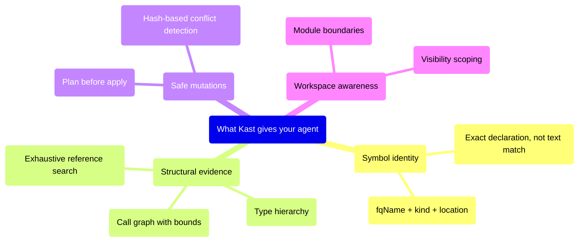

# What Kast gives your agent

LLM agents can already search files and rewrite text. What they usually
lack is a semantic runtime that understands Kotlin the way a compiler does.
Kast fills that gap with four capabilities that text search can never
provide: stable symbol identity, structural call graph evidence,
exhaustive reference search, and conflict-safe edit plans.

## Symbol identity — not string matching

Kast resolves the exact declaration at a position instead of matching
text, so your agent can refer to a symbol by its fully qualified name for
the rest of the conversation.
[Understand symbols →](../what-can-kast-do/understand-symbols.md)

## Structural evidence — not line matches

Kast returns bounded call hierarchies and reference lists with
`searchScope.exhaustive`, so your agent knows exactly which functions are
callers and whether a usage search was complete.
[Trace usage →](../what-can-kast-do/trace-usage.md)

## Safe mutations — not find-and-replace

Kast's two-phase plan→apply flow with SHA-256 file hashes lets your agent
review edits before touching disk and detects conflicts if files change
in between.
[Refactor safely →](../what-can-kast-do/refactor-safely.md)

## Workspace awareness — not file-by-file

Kast analyzes entire Gradle workspaces as a single session, giving your
agent module boundaries and visibility-scoped results rather than
per-file guesses.
[Manage workspaces →](../what-can-kast-do/manage-workspaces.md)

## What your agent can do with Kast

Here are the specific tasks that become reliable when your agent has
semantic code intelligence:

- **Resolve a symbol** before summarizing usage — the agent knows exactly
  which declaration it's talking about.
- **Find all references** and report whether the search was complete —
  the agent doesn't have to guess.
- **Walk a call graph** with explicit bounds — the agent can explain
  where the tree was truncated and why.
- **Plan a rename** with conflict detection — the agent can verify edits
  before touching disk.
- **Find implementations** of an interface — the agent gets concrete
  subclasses, not string matches.
- **Check diagnostics** to verify code compiles after changes — the agent
  catches errors without running the build.

## Next steps

- [Talk to your agent](talk-to-your-agent.md) — how to prompt your agent
  to use Kast effectively
- [Install the skill](install-the-skill.md) — get the packaged Kast
  skill into your workspace
- [Direct CLI usage](direct-cli.md) — when agents call the CLI directly
