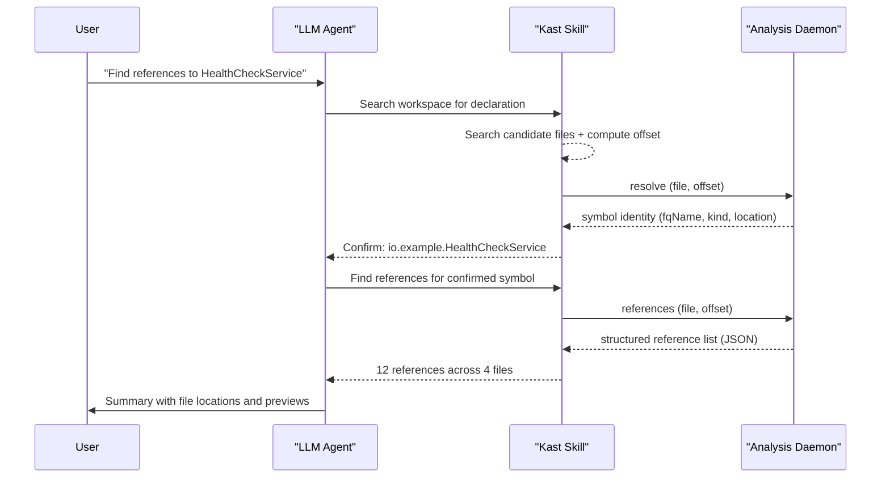

# Talk to your agent about Kast

The packaged skill lets you describe Kotlin symbols the way you'd
describe them to another engineer. No file offsets, no absolute paths,
no JSON-RPC. Name the symbol, say what you want, the skill turns that
into the lookup `kast` needs.

## Start with a conversational reference

Name the target naturally — class name, function name, a property on
its containing type. Then say what to do, then say what the answer
should include.

Three things every prompt should have:

1. **The symbol** — name it the way you'd say it out loud, e.g. "the
   `processOrder` function on `OrderService`."
2. **The action** — resolve, find references, show callers, plan a
   rename.
3. **The answer shape** — fully qualified name, declaration location,
   caller summary, truncation status.

```text title="Example: Resolve a symbol"
Use the kast skill to resolve the retryDelay property on RetryConfig.
Tell me where it's declared and what type Kast reports.
```

```text title="Example: Find references"
Use the kast skill to find references to HealthCheckService in this
workspace. Confirm the declaration first, then summarize the callers.
```

```text title="Example: Call hierarchy"
Use the kast skill to show the incoming call hierarchy for
HealthCheckService.runChecks. Resolve the symbol first, then summarize
the top callers and any truncation.
```

## Follow the golden path

Resolve first, confirm identity, then expand. This kills the most
common failure: the agent guesses which symbol you meant and gets it
wrong.



The four steps:

1. Name the target conversationally.
2. Have the agent resolve the symbol before gathering anything else.
3. Confirm the kind, `fqName`, and declaration location match what you
   meant.
4. Then ask for references, call hierarchy, rename impact, or
   diagnostics.

## When the name is ambiguous, add context

Some workspaces repeat names. When the skill finds multiple candidates,
narrow the match:

- Containing type: "`retryDelay` on `RetryConfig`."
- Module or package: "`loadUser` in the API module."
- A nearby caller: "the `processOrder` called by `CheckoutController`."
- The kind: "the `Config` class, not the `config` property."

```text hl_lines="2" title="Disambiguating by containing type"
Find references to the timeoutMillis property on HttpClientConfig,
not the local variable with the same name.
```

```text hl_lines="1" title="Disambiguating by module"
Resolve loadUser in the API module, the function used by
UserController.
```

## Ask for an answer you can act on

"Found it" is not an answer. Ask for the parts that help you decide
what to do next:

- **`fqName`** — the stable identity
- **Symbol kind** — CLASS, FUNCTION, PROPERTY, INTERFACE
- **Declaration location** — file, line, column
- **References grouped by file** — patterns at a glance
- **Truncation status** — was the hierarchy cut short?
- **`searchScope.exhaustive`** — was every candidate file searched?

## Let the skill handle the mechanics

When your request is clear, the skill:

- Finds the right `kast` binary via its resolver script
- Makes sure the workspace daemon is ready
- Searches for likely declaration sites from your conversational
  reference
- Translates the chosen declaration into a file path and byte offset
- Calls `resolve` first, then expands into `references`,
  `call-hierarchy`, or `rename`

## Next steps

- [Install the skill](install-the-skill.md) — drop the packaged skill
  into your workspace
- [Direct CLI usage](direct-cli.md) — when the agent skips the skill
  and calls `kast` itself
