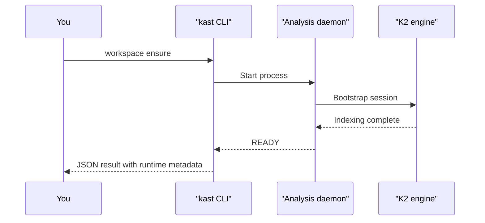

# Quickstart

By the end of this page you'll have asked the daemon two questions —
"what symbol is this?" and "who uses it?" — and gotten structured JSON
back, with proof the search finished.

The walkthrough uses the standalone backend because it works anywhere:
your terminal, a CI runner, an agent loop. If IntelliJ is already open
on the project with the plugin installed, swap `--backend-name=standalone`
for `--backend-name=intellij` and skip the start/stop steps. The plugin
reuses the IDE's analysis session — no second daemon to babysit.

## Before you begin

You need:

- The `kast` CLI installed (see [Install](install.md))
- A Kotlin workspace on your machine — Gradle or plain
- The absolute path to that workspace root

??? info "About Gradle discovery"

    With `settings.gradle(.kts)` or `build.gradle(.kts)` at the root,
    standalone discovery uses Gradle's project model. Without those
    files, `kast` falls back to conventional source roots and a
    source-file scan. The Gradle path matters most for multi-module
    builds.

## Step 1: Start the standalone backend

Run every command from your project root. The first call is the slow
one — the daemon discovers your project and indexes Kotlin files. After
that, you're hitting a warm session.

```console linenums="1" title="Start the daemon"
kast workspace ensure \
  --backend-name=standalone \
  --workspace-root=$(pwd)
```



The first start indexes every Kotlin file. Later commands reuse the warm
state — the cost you pay here buys you fast lookups for the rest of the
session.

!!! tip
    Pass `--accept-indexing=true` to return as soon as the daemon can
    serve requests, even before indexing finishes. Queries during
    indexing may return partial results.

## Step 2: Resolve a symbol

Pick a Kotlin file and a byte offset that lands on a symbol name. `kast`
returns the fully qualified name, kind, signature, and source location
of the declaration at that offset.

!!! tip "How to get an offset"
    The fast way: `grep -bo 'functionName' src/main/kotlin/App.kt`
    prints the byte offset of every match.

```console linenums="1" title="Resolve a symbol"
kast resolve \
  --backend-name=standalone \
  --workspace-root=$(pwd) \
  --file-path=$(pwd)/src/main/kotlin/App.kt \
  --offset=42
```

```json hl_lines="3-4" title="Example response"
{
  "result": {
    "fqName": "com.example.App.processOrder",
    "kind": "FUNCTION",
    "returnType": "OrderResult",
    "parameters": [
      { "name": "orderId", "type": "String" }
    ],
    "location": {
      "filePath": "/workspace/src/main/kotlin/App.kt",
      "startLine": 12, "startColumn": 5
    }
  }
}
```

`fqName` and `kind` are compiler identity, not text matches. Every later
command can stay anchored to this declaration without ambiguity.

## Step 3: Find references

Same file, same offset. Ask for every reference across the workspace.

```console linenums="1" title="Find references"
kast references \
  --backend-name=standalone \
  --workspace-root=$(pwd) \
  --file-path=$(pwd)/src/main/kotlin/App.kt \
  --offset=42
```

```json hl_lines="10-11" title="Example response"
{
  "result": {
    "declaration": {
      "fqName": "com.example.App.processOrder",
      "kind": "FUNCTION"
    },
    "references": [
      {
        "filePath": "/workspace/src/.../CheckoutController.kt",
        "startLine": 45,
        "preview": "app.processOrder(orderId)"
      }
    ],
    "searchScope": {
      "exhaustive": true,
      "candidateFileCount": 12,
      "searchedFileCount": 12
    }
  }
}
```

`searchScope.exhaustive: true` is the part that matters. `kast` walked
every candidate file. The reference list is complete for this workspace
— not a sample, not a best effort.

## Step 4 (optional): stop the daemon

Free the resources when you're done.

```console title="Stop the daemon"
kast workspace stop \
  --backend-name=standalone \
  --workspace-root=$(pwd)
```

## What just happened

Four commands. You:

1. Started a daemon that indexed your Kotlin codebase into a live K2
   session.
2. Resolved a cursor position to a real declaration with type info — no
   string match.
3. Got every reference back, with proof the search was exhaustive.
4. Shut the daemon down cleanly.

Every response is structured JSON. No regex, no guessing, no "we might
have missed some."

## Next steps

- [Understand symbols](../what-can-kast-do/understand-symbols.md) —
  everything `kast` will tell you about a declaration
- [Trace usage](../what-can-kast-do/trace-usage.md) — references, call
  hierarchy, type hierarchy
- [Kast for agents](../for-agents/index.md) — these same commands from
  an LLM
