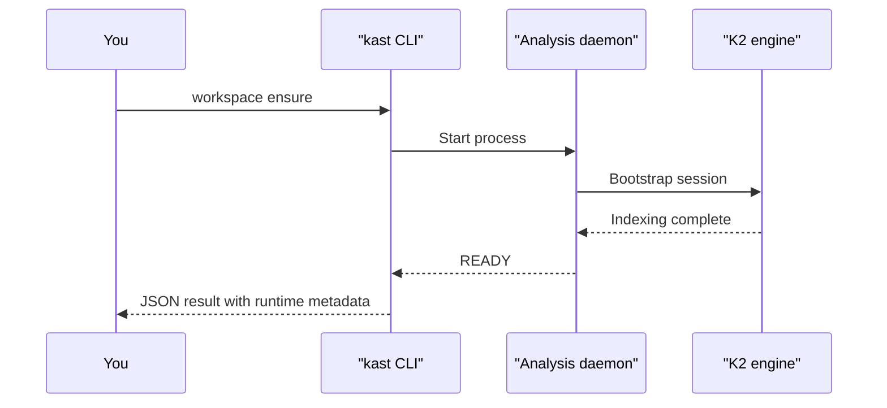

# Quickstart

This page walks you through a first semantic result. By the end, you'll
know exactly which declaration sits at a cursor position and where that
declaration is used across your workspace, with structured JSON you can
hand to a script or agent.

`kast` has two independent runtime modes. This walkthrough uses the
standalone runtime mode because it works in any terminal, CI job, or
agent session. If IntelliJ IDEA is already open with the plugin
installed, skip the standalone startup and shutdown steps, then run the
resolve and references commands with `--backend-name=intellij` instead.
That plugin-backed runtime piggybacks on IntelliJ's already-open project
model, indexes, and analysis session, so there is no separate daemon to
start or stop.

## Before you begin

Make sure you have:

- The `kast` CLI installed (see [Install](install.md))
- A Kotlin workspace on your machine (any Gradle or standalone Kotlin
  project)
- The absolute path to that workspace root

For standalone discovery, Gradle files are helpful but not always
required.

> **Note:** If the workspace root contains `settings.gradle.kts`,
> `settings.gradle`, `build.gradle.kts`, or `build.gradle`, the
> standalone backend uses Gradle-aware discovery. Without those files,
> `kast` still falls back to conventional source roots and source-file
> scanning. A root `settings.gradle.kts` matters most for multi-module
> Gradle workspaces.

## Step 1: Start the standalone backend

Tell `kast` which workspace to analyze. This starts the standalone
daemon and waits until it finishes indexing.

```console linenums="1" title="Start the daemon"
kast workspace ensure \
  --backend-name=standalone \
  --workspace-root=/absolute/path/to/workspace
```



The first start takes longer because the daemon discovers your project
structure and indexes every Kotlin file. Later commands reuse that warm
state. This command is the one-time setup cost that turns later semantic
queries into fast lookups.

!!! tip
    Pass `--accept-indexing=true` if you want the command to return as
    soon as the daemon is servable, even if indexing hasn't finished.
    Queries during indexing may return partial results.

## Step 2: Resolve a symbol

Pick any Kotlin file in your workspace and an offset pointing at a
symbol you want to identify. `kast` returns the fully qualified name,
kind, parameters, return type, and source location.

```console linenums="1" title="Resolve a symbol"
kast resolve \
  --backend-name=standalone \
  --workspace-root=/absolute/path/to/workspace \
  --file-path=/absolute/path/to/workspace/src/main/kotlin/App.kt \
  --offset=42
```

```json hl_lines="3-4" title="Example response"
{
  "result": {
    "fqName": "com.example.App.processOrder",
    "kind": "FUNCTION",
    "returnType": "OrderResult",
    "parameters": [
      { "name": "orderId", "type": "String" }
    ],
    "location": {
      "filePath": "/workspace/src/main/kotlin/App.kt",
      "startLine": 12, "startColumn": 5
    }
  }
}
```

This first result answers the question, "What symbol is this, exactly?"
The `fqName` and `kind` give you compiler identity, not a text match.
The signature and location tell you what the declaration does and where
it lives. That is the value of the first result: every later command can
stay anchored to the same declaration with no ambiguity.

## Step 3: Find references

Using the same file and offset, ask Kast for every reference to that
symbol across the workspace.

```console linenums="1" title="Find references"
kast references \
  --backend-name=standalone \
  --workspace-root=/absolute/path/to/workspace \
  --file-path=/absolute/path/to/workspace/src/main/kotlin/App.kt \
  --offset=42
```

```json hl_lines="10-11" title="Example response"
{
  "result": {
    "declaration": {
      "fqName": "com.example.App.processOrder",
      "kind": "FUNCTION"
    },
    "references": [
      {
        "filePath": "/workspace/src/.../CheckoutController.kt",
        "startLine": 45,
        "preview": "app.processOrder(orderId)"
      }
    ],
    "searchScope": {
      "exhaustive": true,
      "candidateFileCount": 12,
      "searchedFileCount": 12
    }
  }
}
```

Notice `searchScope.exhaustive: true` — this means Kast searched every
candidate file. The reference list is complete for this workspace, not a
sample. In one step, you go from "what declaration is this?" to "who
uses it?" with proof that the search finished.

## Step 4: Optional: stop the daemon

If you used the standalone path for this walkthrough, stop the daemon to
free resources.

```console title="Stop the daemon"
kast workspace stop \
  --backend-name=standalone \
  --workspace-root=/absolute/path/to/workspace
```

## What just happened

In four commands, you:

1. **Started a workspace daemon** that indexed your entire Kotlin
   codebase into a live analysis session.
2. **Resolved a symbol** to its exact declaration with full type
   information — not a string match, but a compiler-backed identity.
3. **Found every reference** with a proof of completeness
   (`exhaustive: true`).
4. **Stopped the daemon** cleanly.

Every command returned structured JSON that a script, agent, or pipeline
can parse directly. No regex, no guessing, no "might have missed some."

## Next steps

- [Understand symbols](../what-can-kast-do/understand-symbols.md) —
  everything Kast tells you about a declaration
- [Trace usage](../what-can-kast-do/trace-usage.md) — references,
  call hierarchy, and type hierarchy
- [Kast for agents](../for-agents/index.md) — how LLM agents use
  these same commands
