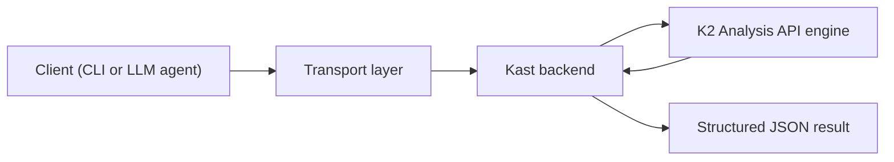

This page explains the high-level path a Kast request takes and the two
backend options you can choose from. Keep it in mind when you want to
understand why the first command is slower, why repeated commands get faster,
and why results stay tied to one workspace.

## Request flow

Each Kast request moves through three layers. A client sends a JSON-RPC
request over a transport — Unix domain sockets by default for CLI workflows,
with TCP available as an advanced option for direct JSON-RPC clients. The
backend keeps the analysis session warm and hands the semantic work to the
Kotlin K2 Analysis API engine. Kast then returns a structured JSON result to
the caller.

The CLI uses Unix domain sockets by default. TCP is available as an advanced
transport for direct JSON-RPC clients connecting to a running server.

The backend can run in two modes: as a standalone daemon managed by the CLI,
or as an IntelliJ IDEA plugin that starts automatically when you open a
project.

## Two backends

Kast ships two backend implementations. Both expose the same JSON-RPC
protocol, typically over a Unix domain socket, so callers don't need to know
which one is running.

### Standalone backend

The standalone backend runs as an independent JVM process outside any IDE. The
`kast` CLI starts it on demand, and it stays alive per workspace until you stop
it. This is the right choice when you work from the terminal, in CI, or from
an LLM agent without IntelliJ running.

- Discovers workspace layout via the Gradle Tooling API (or falls back to
  conventional source roots).
- Bootstraps its own K2 analysis session from extracted IntelliJ platform
  libraries.
- Supports the full capability set, including call hierarchy and type
  hierarchy.

### IntelliJ plugin backend

The IntelliJ plugin backend runs inside a running IntelliJ IDEA instance. It
piggybacks on the IDE's existing K2 analysis session, project model, and
indexes. This is the right choice when you already have IntelliJ open and want
Kast analysis without a second JVM process.

- Starts automatically when IntelliJ opens a project (disable with the
  `KAST_INTELLIJ_DISABLE` environment variable).
- Reuses the IDE's project model, so there is no separate workspace discovery
  step.
- Supports most capabilities. Call hierarchy and type hierarchy are not yet
  available through the plugin backend.

### Capability comparison

Both backends advertise their capabilities through the `capabilities` command.
The table below summarizes the current differences.

| Capability                | Standalone | IntelliJ plugin |
|---------------------------|:----------:|:---------------:|
| Symbol resolution         | ✓          | ✓               |
| Find references           | ✓          | ✓               |
| File outline              | ✓          | ✓               |
| Workspace symbol search   | ✓          | ✓               |
| Call hierarchy            | ✓          | —               |
| Type hierarchy            | ✓          | —               |
| Semantic insertion point  | ✓          | ✓               |
| Diagnostics               | ✓          | ✓               |
| Rename                    | ✓          | ✓               |
| Apply edits               | ✓          | ✓               |
| File operations           | ✓          | ✓               |
| Optimize imports          | ✓          | ✓               |
| Refresh workspace         | ✓          | ✓               |

## Why a daemon?

Starting a Kotlin analysis session is the expensive part. Kast keeps that
session alive per workspace so the first command pays the startup cost and
later commands reuse warm state.

- **The first command is slower.** Workspace discovery, session startup, and
  initial indexing happen up front.
- **Later commands are faster.** The backend reuses loaded state instead of
  rebuilding it for every request.
- **One process holds the analysis context.** Caches and indexes stay with the
  workspace until you stop the daemon or point Kast at a different workspace.

When you use the IntelliJ plugin backend, IntelliJ itself is the long-lived
process. The plugin starts the Kast server as part of the IDE lifecycle, so
there is no separate daemon to manage.

## Workspace model

Kast always starts from a workspace root. In the standalone backend, it
discovers modules, source roots, and classpath information from the Gradle
model. Outside Gradle, it falls back to conventional source roots and
discovered Kotlin or Java directories. In the IntelliJ plugin backend, the
IDE's own project model provides the same information. Either way, the backend
analyzes that workspace as one session, which is why read results stay
workspace-scoped.

## Next steps

- [Things to know](things-to-know.md)
- [Get started](get-started.md)
- [Run analysis commands](run-analysis-commands.md)
