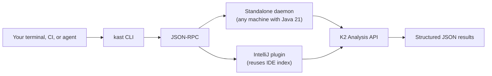

# IDE-grade Kotlin code intelligence — anywhere you need it

Kast gives you the same semantic analysis that powers IntelliJ IDEA, but as
a headless daemon with structured JSON output. Run it in your terminal, pipe
it through CI, hand it to an LLM agent, or spin it up on a cloud VM. Every
command returns machine-readable JSON that tells you exactly what the Kotlin
compiler knows — symbol identity, caller relationships, reference
exhaustiveness, and conflict-safe edit plans.



## What makes Kast different

Kast replaces text search with compiler-backed answers. Four capabilities
set it apart from `grep`, `rg`, and ad-hoc refactoring scripts.

- **Symbol identity, not text matching** — Kast resolves the exact compiler
  declaration at a position and returns its fully qualified name, kind, and
  location. [Learn more →](what-can-kast-do/understand-symbols.md)
- **Exhaustive reference search** — Every reference result includes
  `searchScope.exhaustive`, proving whether every candidate file was
  searched. [Learn more →](what-can-kast-do/trace-usage.md)
- **Bounded call hierarchy** — Call trees include explicit depth, fan-out,
  and timeout limits with truncation metadata on every node.
  [Learn more →](what-can-kast-do/trace-usage.md#expand-the-call-hierarchy)
- **Safe mutations** — Rename uses a two-phase plan→apply flow with
  SHA-256 file hashes for conflict detection.
  [Learn more →](what-can-kast-do/refactor-safely.md)

Kast isn't a replacement for your editor's LSP — it's the tool for when
work happens outside an editor.
[Full comparison →](architecture/kast-vs-lsp.md)

Kast ships a standalone daemon and an IntelliJ plugin. Both speak the same
protocol. [Learn more →](getting-started/backends.md)

## See it on your code

`kast demo` runs an interactive comparison of grep-based text search versus
Kast's semantic analysis on your own workspace. It picks a symbol, shows
what grep gets wrong, then runs resolve, references, rename (dry-run), and
call-hierarchy to show the difference.

```console
kast demo --workspace-root=/path/to/your/kotlin/project
kast demo --workspace-root=/path/to/your/kotlin/project --symbol=YourClassName
```

## Get running in 60 seconds

```console linenums="1" title="From zero to first result"
# Install
/bin/bash -c "$(curl -fsSL \
  https://raw.githubusercontent.com/amichne/kast/HEAD/kast.sh)"
# Or: curl -fsSL https://raw.githubusercontent.com/amichne/kast/HEAD/kast.sh | bash

# Start the daemon
kast workspace ensure \
  --workspace-root=/path/to/your/project

# Resolve a symbol
kast resolve \
  --workspace-root=/path/to/your/project \
  --file-path=/path/to/your/project/src/main/kotlin/App.kt \
  --offset=42
```

That's it. Three commands: install, start, query. The daemon stays warm
for subsequent commands, so everything after the first query is fast.

[Full install guide →](getting-started/install.md) ·
[Quickstart tutorial →](getting-started/quickstart.md)

## Next steps

<div class="grid cards" markdown>

- **Get started**

  ---

  Install Kast, run your first query, and understand the two backends.

  [Install →](getting-started/install.md)

- **See what Kast can do**

  ---

  Explore every capability with real examples and content tabs.

  [Understand symbols →](what-can-kast-do/understand-symbols.md)

- **Use Kast from an agent**

  ---

  Give your LLM agent semantic code intelligence it can't get from grep.

  [For agents →](for-agents/index.md)

- **Dive into the architecture**

  ---

  Learn how the daemon, JSON-RPC transport, and K2 Analysis API fit
  together.

  [How it works →](architecture/how-it-works.md)

</div>
