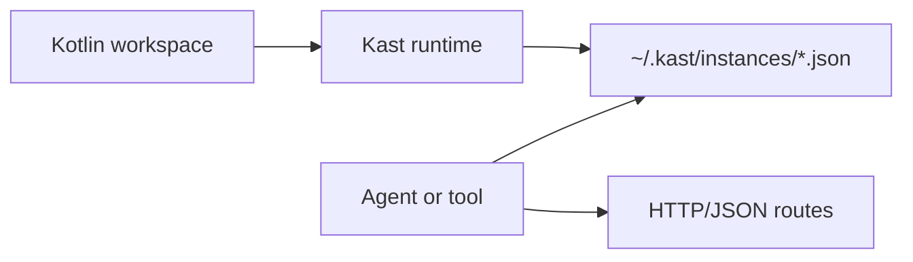

Kast gives tools and agents one HTTP/JSON contract for Kotlin analysis,
regardless of whether the engine is running inside IntelliJ or as a standalone
JVM process. The current build already supports runtime discovery, capability
negotiation, PSI-backed analysis in the IntelliJ host, and backend-agnostic
text edit application.

-   **Choose a runtime**

    Compare the IntelliJ and standalone hosts before you wire one into your
    workflow.

    [Decide which host to start](choose-a-runtime.md)

-   **Get started**

    Build a runtime, discover its descriptor file, and make your first
    request.

    [Open the quickstart](get-started.md)

-   **HTTP API**

    Learn the route map, request conventions, and capability-gated
    operations.

    [Read the reference](api-reference.md)

-   **Operate runtimes**

    See how descriptor registration, limits, tokens, and host behavior work.

    [Read the operator guide](operator-guide.md)

-   **Track the gap**

    Review what is implemented now and what remains before the full design
    lands.

    [Read the remaining work](remaining-work.md)

## Runtime model

Every Kast instance follows the same discovery and request flow. Clients read
the descriptor directory first, then call the advertised host and port instead
of assuming one fixed local endpoint.

## What exists today

The transport surface is broader than the production capability set, so the
important distinction is what each host advertises right now.

| Host | Intended use | Current capabilities |
| --- | --- | --- |
| IntelliJ plugin | Local development | `RESOLVE_SYMBOL`, `FIND_REFERENCES`, `DIAGNOSTICS`, `RENAME`, `APPLY_EDITS` |
| Standalone process | CI and headless workflows | `RESOLVE_SYMBOL`, `FIND_REFERENCES`, `DIAGNOSTICS`, `RENAME`, `APPLY_EDITS` |

> **Note:** The `/api/v1/call-hierarchy` route exists, but no production
> backend advertises `CALL_HIERARCHY` yet.

## Next steps

Start with [Choose a runtime](choose-a-runtime.md) if you need to decide
between the IntelliJ and standalone hosts. Use
[Get started](get-started.md) once you are ready to start one, then keep
[Operator guide](operator-guide.md) open when you need the runtime defaults and
descriptor details.
