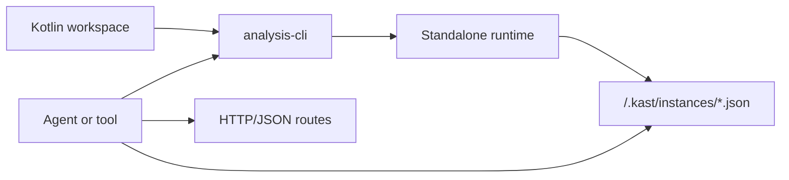

Kast gives tools and agents one HTTP/JSON contract for Kotlin analysis through
a single supported runtime model: the repo-local CLI manages a standalone
daemon, and clients can keep using that CLI or call the daemon's advertised
HTTP endpoint directly once it is ready.

-   **Runtime model**

    See how the CLI control plane, descriptor files, and standalone daemon fit
    together.

    [Understand the supported flow](choose-a-runtime.md)

-   **Get started**

    Build the CLI, ensure a workspace runtime, and make your first request.

    [Open the quickstart](get-started.md)

-   **HTTP API**

    Learn the route map, request conventions, and capability-gated operations.

    [Read the reference](api-reference.md)

-   **Operator guide**

    See how descriptor registration, limits, tokens, and command behavior work.

    [Read the operator guide](operator-guide.md)

-   **Track the gap**

    Review what is implemented now and what remains before the standalone
    runtime is feature-complete.

    [Read the remaining work](remaining-work.md)

## Runtime model

Every supported Kast flow follows the same pattern: the repo-local CLI ensures
a standalone runtime for one workspace, the runtime writes a descriptor, and
clients either keep using the CLI or call the advertised host and port over
HTTP.

## What exists today

The transport surface is broader than the remaining product gap, so the useful
distinction is which supported surface does what today.

| Surface | Intended use | Current behavior |
| --- | --- | --- |
| `analysis-cli` | Default operator and agent workflow | Detached daemon management, readiness checks, capability-gated JSON commands |
| Standalone daemon | Kotlin analysis engine | `RESOLVE_SYMBOL`, `FIND_REFERENCES`, `DIAGNOSTICS`, `RENAME`, `APPLY_EDITS` |
| Direct HTTP | Low-level integration after bootstrap | Same `/api/v1` contract once the descriptor identifies one ready standalone runtime |

> **Note:** The `/api/v1/call-hierarchy` route exists, but no production
> backend advertises `CALL_HIERARCHY` yet.

## Next steps

Start with [Runtime model](choose-a-runtime.md) if you need to decide between
the CLI control plane and direct HTTP. Use [Get started](get-started.md) once
you are ready to start a workspace runtime, then keep
[Operator guide](operator-guide.md) open for command and descriptor details.
