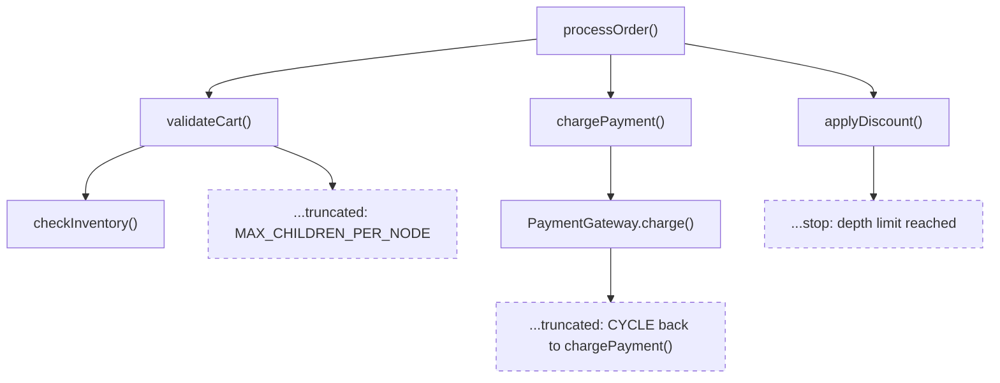

Kast is most useful when you know how to read its boundaries. This page
explains the behavioral model behind the major results so you can tell the
difference between "there is no result," "the workspace cannot see that code,"
and "Kast stopped on purpose."

## Everything is workspace-scoped

Kast attaches one daemon to one workspace root and builds one analysis session
for that workspace. References, call hierarchy, diagnostics, and edit plans
only cover files inside that session. If code lives outside the workspace root
or outside the discovered source roots, Kast does not include it in those
result sets.

## Call hierarchy is intentionally bounded

A call hierarchy result is not an unbounded whole-program graph. Kast stops
expanding the tree based on depth, max total calls, max children per node, and
timeout. By default, the query starts with depth `3`, max total calls `256`,
max children per node `64`, and the daemon's request timeout unless you pass
an explicit timeout. Read `stats` and node `truncation` data before you claim
the tree is complete.

Use this conceptual tree to interpret what you see in real results.

- **Dashed nodes** mark places where expansion stopped. When a node includes
  `truncation`, read `truncation.reason` to see why. Depth-limited leaves stop
  because the configured depth ran out, so they do not carry a truncation
  reason.
- **Cycle** means Kast found a recursive path and stopped that branch with
  `truncation.reason: CYCLE`. This is not an error.
- **Depth limit** means the query reached the configured `depth`. Increase
  `depth` if you need to see further, and use `stats.maxDepthReached` to see
  how deep the returned tree went.
- **MAX_CHILDREN_PER_NODE** means the node had more direct callers or callees
  than the query allowed. The result is partial at that node.
- **MAX_TOTAL_CALLS** and **TIMEOUT** can also stop expansion. Kast reports
  those through `truncation.reason` on the affected node and the matching
  fields in `stats`.
- **Absent nodes** are calls outside the workspace root. Kast filters those
  out entirely, so standard library and external dependency calls do not
  appear as normal tree edges.

## Entry points have no incoming callers

Some functions are genuine entry points even when Kast returns no incoming
callers. `main` functions, tests, framework callbacks, and public APIs called
from outside the workspace all fit that pattern. "No incoming callers" only
means "no callers visible inside this workspace."

## Cycles are detected and reported

Recursive and mutually recursive paths do not explode the tree. Kast stops
when it sees a symbol that is already on the current path and marks that node
with `truncation.reason: CYCLE`. You still learn that recursion exists, but
the result stays finite and readable.

## Symbol resolution is position-based

Kast resolves the symbol at a file offset. It does not start from a simple
name unless a higher-level tool first translates your human description into a
file and offset. Two classes with the same name are distinct if they are
different declarations in different files or packages, which is why position
beats text matching when identity matters.

## Reference search is visibility-scoped

Kast narrows the files it searches based on the resolved symbol's Kotlin
visibility. Private and local symbols only need the declaring file. Internal
symbols stay inside the declaring module. Public and protected symbols use
the identifier index to find candidate files across dependent modules.

The `searchScope` object returned with `references` and `rename` results
describes the actual search that ran.

- `searchScope.visibility` — the Kotlin visibility Kast resolved for the
  symbol (`PUBLIC`, `INTERNAL`, `PROTECTED`, `PRIVATE`, `LOCAL`, or
  `UNKNOWN`).
- `searchScope.scope` — the breadth of the search: `FILE`, `MODULE`, or
  `DEPENDENT_MODULES`.
- `searchScope.exhaustive` — `true` when every candidate file was searched.
  `false` means the search was bounded by a missing index or an incomplete
  scope. Treat results as partial when this is `false`.
- `searchScope.candidateFileCount` and `searchScope.searchedFileCount` —
  how many files were candidates versus how many were actually searched.

Read `searchScope.exhaustive` before you claim a reference list or rename
plan is complete. If it is `false`, results may miss usages outside the
searched scope.

## File outline shows named declarations only

The `outline` command returns a nested tree of the named declarations in a
file. It includes classes, objects, named functions, and named properties. It
excludes function parameters, anonymous elements such as lambda expressions or
object literals, and local declarations inside function bodies. The nesting
reflects the actual structure of the source file: a top-level class that
contains member functions and nested classes has those as children in the
outline tree.

Use outline results as a structural overview, not as a complete list of every
identifier in the file.

## Workspace symbol search is name-based, not position-based

`workspace-symbol` finds declarations by name across every file in the
workspace. The default search is a case-insensitive substring match, so
`--pattern=Check` matches `HealthCheckService`, `checkInventory`, and
`runChecks`. Pass `--regex=true` when you need pattern-based matching such as
anchored names or alternation.

Results are capped by the requested limit (default 100). Read
`page.truncated` before you treat the result as complete. If it is `true`,
there are more matches than the result contains.

Workspace symbol search returns symbol metadata, not a resolved position. The
entries include name, kind, file path, and location, but they are not the same
as a `resolve` result. Always follow up with `resolve` when you need the full
symbol identity, supertypes, or visibility information.

## Rename plans use hash-based conflict detection

Rename planning returns edits together with `fileHashes`. Those hashes are
SHA-256 snapshots of the files Kast expects to change. When you later apply the
plan, Kast recomputes the current hashes and rejects the apply if a file
changed after the plan was created. Treat the returned `fileHashes` as part of
the contract, and don't edit them by hand.

## One backend per workspace

Kast runs one backend per workspace root. With the standalone CLI, each
workspace gets its own daemon process. With the IntelliJ plugin, each open
project gets its own Kast server inside the IDE. If you analyze two checkouts
or two repositories, each one gets its own analysis state. That isolation
keeps source indexes, caches, and refresh behavior tied to the workspace you
actually asked about.

## The daemon refreshes automatically

Kast keeps workspace state fresh without making you restart the daemon for
normal edits. `apply-edits` writes the prepared changes, then refreshes the
affected files or the full workspace when file creation or deletion changed
the layout. For external `.kt` file changes, a background watcher batches
create, modify, and delete events under the registered source roots and
refreshes the session automatically. `workspace refresh` exists as the manual
recovery path.

## Next steps

If you want the higher-level system view next, move to the architecture page.
If you are ready to run Kast, move to installation and workflow setup.

- [How Kast works](how-it-works.md)
- [Get started](get-started.md)
- [Use Kast from an LLM agent](use-kast-from-an-llm-agent.md)
