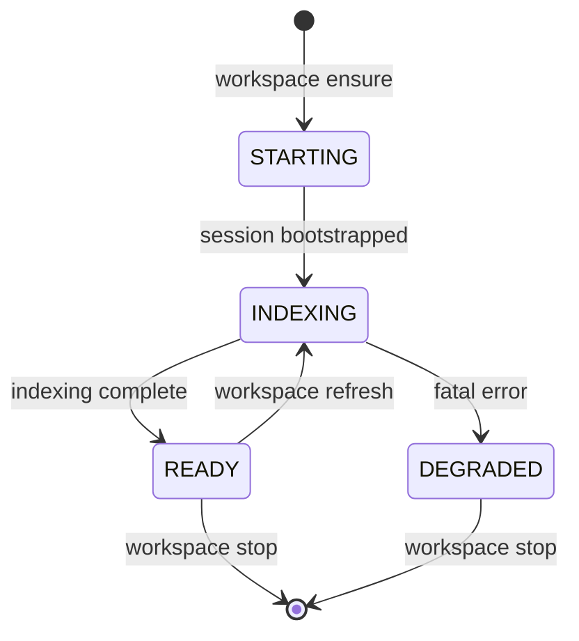
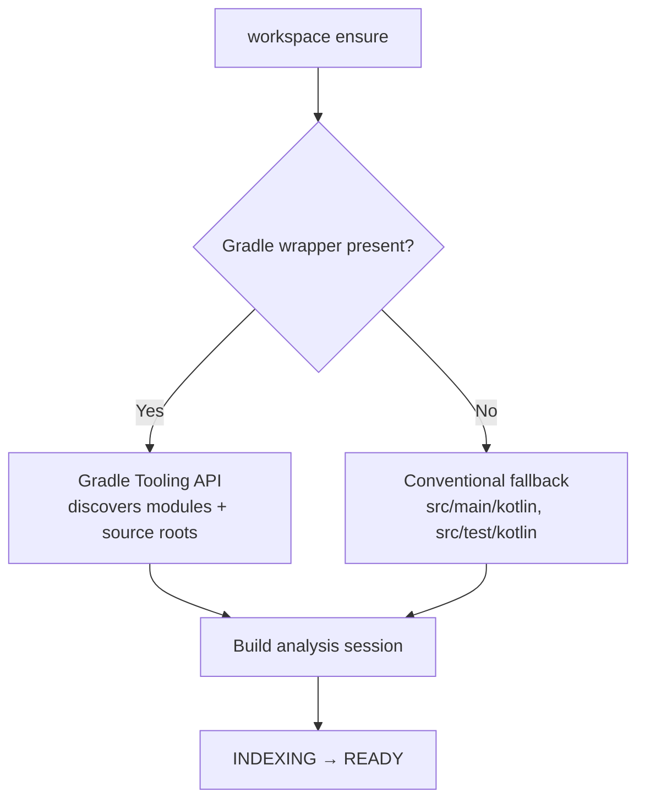

# Manage workspaces

Kast runs a long-lived daemon per workspace. These operations let you start
the daemon, check its state, inspect the workspace structure it discovered,
and stop it when you're done. Understanding the lifecycle helps you write
automation that starts clean and exits clean.

## Daemon lifecycle

The daemon moves through a predictable set of states. Knowing these states
helps you decide when to send queries and when to wait.



- **STARTING** — the daemon process launched but hasn't bootstrapped the
  analysis session yet.
- **INDEXING** — the K2 session is active and scanning source files. Semantic
  queries can return partial results during this state.
- **READY** — indexing is complete. All queries return full results.
- **DEGRADED** — a fatal error occurred during indexing. Stop the daemon
  and investigate.

### Start the daemon

Use `workspace ensure` to start the daemon and block until it reaches a
servable state.

```console title="Start the daemon and wait for READY"
kast workspace ensure \
  --workspace-root=/absolute/path/to/workspace
```

Pass `--accept-indexing=true` when you only need the daemon to be
servable and can tolerate partial results while indexing finishes.

### Check daemon state

Use `workspace status` to see whether the daemon is running and what
state it's in.

```console title="Check daemon state"
kast workspace status \
  --workspace-root=/absolute/path/to/workspace
```

### Stop the daemon

Use `workspace stop` when you're done. This keeps the lifecycle explicit
and avoids leaving orphaned processes.

```console title="Stop the daemon cleanly"
kast workspace stop \
  --workspace-root=/absolute/path/to/workspace
```

## Workspace discovery

When the daemon starts, it discovers your project structure automatically.
The discovery strategy depends on what's in your workspace root.



For Gradle projects, Kast uses the Gradle Tooling API to discover
modules, source roots, and classpath information. For non-Gradle projects,
it falls back to conventional Kotlin source root directories.

## Refresh the workspace

Kast watches source roots for `.kt` file changes and refreshes
automatically. `apply-edits` also triggers an immediate refresh for the
files it modified. Use `workspace refresh` only as a manual recovery path
when an external change was missed.

```console title="Full workspace refresh"
kast workspace refresh \
  --workspace-root=/absolute/path/to/workspace
```

For a targeted refresh of specific files, pass `--file-paths`:

```console title="Targeted refresh"
kast workspace refresh \
  --workspace-root=/absolute/path/to/workspace \
  --file-paths=/absolute/path/to/src/main/kotlin/App.kt
```

## Inspect workspace files

Use `workspace/files` to see the modules and source roots the daemon
discovered. File-path enumeration is capped per module so large workspaces
can inspect scope without forcing the daemon to materialize every path in
one response.

=== "CLI"

    ```console title="List workspace files"
    kast workspace files \
      --workspace-root=/absolute/path/to/workspace \
      --include-files=true \
      --max-files-per-module=500
    ```

=== "JSON-RPC"

    ```json title="JSON-RPC request"
    {
      "method": "workspace/files",
      "params": {
        "includeFiles": true,
        "maxFilesPerModule": 500
      },
      "id": 1, "jsonrpc": "2.0"
    }
    ```

```json hl_lines="6-8" title="Response — module structure"
{
  "modules": [
    {
      "name": "app",
      "sourceRoots": ["/workspace/app/src/main/kotlin"],
      "dependencyModuleNames": ["lib-core", "lib-api"],
      "files": ["/workspace/app/src/main/kotlin/com/example/App.kt"],
      "filesTruncated": false,
      "fileCount": 1
    }
  ],
  "schemaVersion": 3
}
```

## Check capabilities

Use `capabilities` to see which operations the current backend supports.
This is especially important in automation where you need to confirm
support before calling an operation.

```console title="Query supported capabilities"
kast capabilities \
  --workspace-root=/absolute/path/to/workspace
```

## Check runtime health

Use `health` for a lightweight liveness check and `runtime/status` for
detailed runtime metadata.

```console title="Liveness check"
kast health --workspace-root=/absolute/path/to/workspace
```

## Next steps

- [Backends](../getting-started/backends.md) — understand when to use
  standalone vs IntelliJ plugin
- [How Kast works](../architecture/how-it-works.md) — the full
  architecture story
