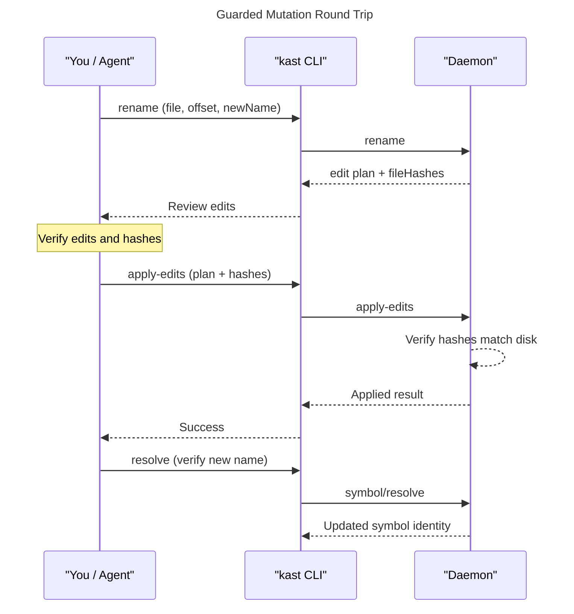

`kast` never writes code behind your back. Every mutation follows
**plan → hash → apply**: you ask for a change, `kast` returns an
edit plan plus content hashes of the files it read, you eyeball the
plan, then send it back for application. If any file changed on
disk in between, the hashes won't match and the daemon refuses to
write. Conflict-aware, fully auditable, no surprises.

## The plan → hash → apply flow

The sequence below is the full round-trip for a guarded rename. The
same flow applies to any mutation that returns `fileHashes`.




## Rename a symbol

`rename` computes every text edit needed to rename a symbol across
the workspace — without writing anything. The response carries
`fileHashes` you can pipe straight into `apply-edits`.

=== "CLI"

    ```console title="Plan a rename"
    kast rename \
      --workspace-root=$(pwd) \
      --file-path=$(pwd)/src/Sample.kt \
      --offset=20 \
      --new-name=welcome
    ```

=== "JSON-RPC"

    ```json title="rename request"
    {
      "method": "rename",
      "id": 1,
      "jsonrpc": "2.0",
      "params": {
        "position": {
          "filePath": "/workspace/src/Sample.kt",
          "offset": 20
        },
        "newName": "welcome",
        "dryRun": true
      }
    }
    ```

=== "Ask your agent"

    ```text title="Natural-language prompt"
    Use the kast skill to rename the function at offset 20 in
    /workspace/src/Sample.kt to "welcome". Show me the edit plan
    before applying it.
    ```

The response contains the full edit plan:

```json title="rename response" hl_lines="8 9 10"
{
  "edits": [
    {
      "filePath": "/workspace/src/Sample.kt",
      "startOffset": 20,
      "endOffset": 25,
      "newText": "welcome"
    },
    {
      "filePath": "/workspace/src/Sample.kt",
      "startOffset": 48,
      "endOffset": 53,
      "newText": "welcome"
    }
  ],
  "fileHashes": [
    {
      "filePath": "/workspace/src/Sample.kt",
      "hash": "fd31168346a51e49dbb21eca8e5d7cc897afe7116bb3ef21754f782ddb261f72"
    }
  ],
  "affectedFiles": ["/workspace/src/Sample.kt"]
}
```

`fileHashes` captures the content hash of every affected file at
plan time. Hold onto these — you'll send them back when you apply.

!!! tip
    Rename defaults to `dryRun: true`. Set `dryRun: false` in the
    JSON-RPC request to compute and apply in one call. The CLI
    always uses dry-run so you can review before writing.

## Apply edits

Once you've reviewed the plan, send it back with the same
`fileHashes`. The daemon re-reads each file, recomputes the hash,
and rejects the request if anything drifted.

=== "CLI"

    ```console title="Apply the rename plan"
    kast apply-edits \
      --workspace-root=$(pwd) \
      --request-file=rename-plan.json
    ```

    Save the rename response into `rename-plan.json` and pass it
    with `--request-file`. The CLI forwards `edits` and `fileHashes`
    to the daemon.

=== "JSON-RPC"

    ```json title="edits/apply request" hl_lines="14 15 16 17 18 19"
    {
      "method": "edits/apply",
      "id": 2,
      "jsonrpc": "2.0",
      "params": {
        "edits": [
          {
            "filePath": "/workspace/src/Sample.kt",
            "startOffset": 20,
            "endOffset": 25,
            "newText": "welcome"
          },
          {
            "filePath": "/workspace/src/Sample.kt",
            "startOffset": 48,
            "endOffset": 53,
            "newText": "welcome"
          }
        ],
        "fileHashes": [
          {
            "filePath": "/workspace/src/Sample.kt",
            "hash": "fd31168346a51e49dbb21eca8e5d7cc897afe7116bb3ef21754f782ddb261f72"
          }
        ]
      }
    }
    ```

=== "Ask your agent"

    ```text title="Natural-language prompt"
    Apply the rename plan you just showed me.
    ```

When the hashes match, the daemon writes the edits and responds:

```json title="edits/apply response"
{
  "applied": [
    {
      "filePath": "/workspace/src/Sample.kt",
      "startOffset": 20,
      "endOffset": 25,
      "newText": "welcome"
    },
    {
      "filePath": "/workspace/src/Sample.kt",
      "startOffset": 48,
      "endOffset": 53,
      "newText": "welcome"
    }
  ],
  "affectedFiles": ["/workspace/src/Sample.kt"]
}
```

If a file changed between plan and apply, the daemon returns an
error instead of writing partial edits. Re-run the rename to get a
fresh plan with current hashes.

## Verify the result

Conflict detection guarantees the edits `kast` wrote match the
edits `kast` planned. It does *not* guarantee the result still
compiles. After any non-trivial refactor, run diagnostics on the
affected files — or re-resolve the renamed symbol to confirm
identity survived.

```console title="Confirm the workspace still compiles"
kast diagnostics \
  --workspace-root=$(pwd) \
  --file-paths=$(pwd)/src/Sample.kt
```

```console title="Or re-resolve the renamed symbol"
kast resolve \
  --workspace-root=$(pwd) \
  --file-path=$(pwd)/src/Sample.kt \
  --offset=20
```

If diagnostics surface an unexpected error — or resolve returns a
different symbol — read the [stale-results troubleshooting
entry](../troubleshooting.md) before trying another rename. The
daemon may need a `workspace refresh` to pick up edits made outside
its observation window.

## Optimize imports

`optimize-imports` removes unused imports and sorts the rest for
the files you name. Same plan-and-apply shape as rename: you get an
edit plan with `fileHashes`, you review, you apply.

=== "CLI"

    ```console title="Optimize imports"
    kast optimize-imports \
      --workspace-root=$(pwd) \
      --file-paths=$(pwd)/src/Sample.kt
    ```

=== "JSON-RPC"

    ```json title="imports/optimize request"
    {
      "method": "imports/optimize",
      "id": 3,
      "jsonrpc": "2.0",
      "params": {
        "filePaths": ["/workspace/src/Sample.kt"]
      }
    }
    ```

=== "Ask your agent"

    ```text title="Natural-language prompt"
    Use the kast skill to optimize imports in
    /workspace/src/Sample.kt.
    ```

Same shape as rename — `edits`, `fileHashes`, `affectedFiles`.
Send to `apply-edits` when ready.

## Next steps

- [Validate code](validate-code.md) — run diagnostics after your
  refactor to confirm the workspace compiles cleanly
- [Conflict-rejected apply](../troubleshooting.md) — what to do
  when the daemon refuses to write because hashes drifted
