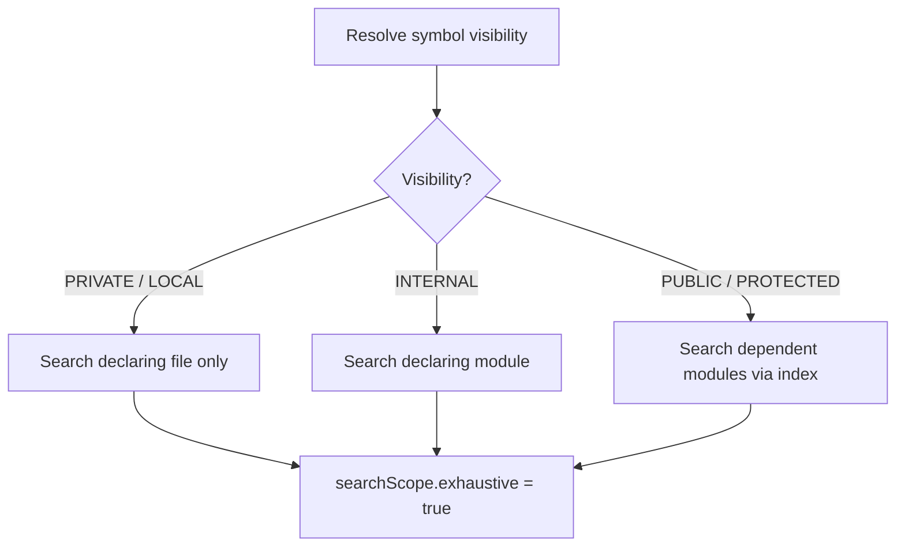
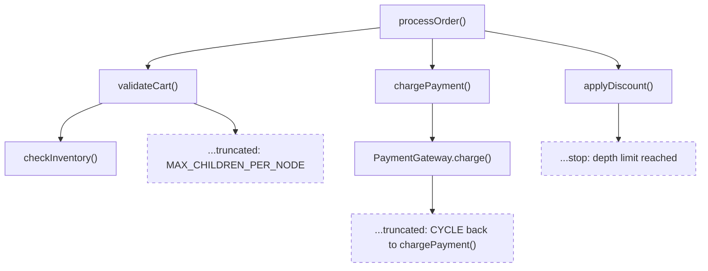

Once you can name a symbol, the next questions are: who touches it,
who calls it, and what sits above or below it in the type tree.
These three operations — `references`, `call-hierarchy`, and
`type-hierarchy` — answer those questions and tell you whether the
answer is complete.

## Find references

`references` returns every usage of a resolved symbol in the
workspace. `kast` narrows the file search based on the symbol's
Kotlin visibility: a `private` function searches its declaring file,
an `internal` function searches its module, a `public` function
searches every dependent module via the identifier index. You only
pay for the scope the language actually requires.

=== "CLI"

    ```console title="Find all references to a symbol"
    kast references \
      --workspace-root=$(pwd) \
      --file-path=$(pwd)/src/main/kotlin/com/shop/OrderService.kt \
      --offset=42 \
      --include-declaration=true
    ```

=== "JSON-RPC"

    ```json title="references request"
    {
      "method": "references",
      "id": 1,
      "jsonrpc": "2.0",
      "params": {
        "position": {
          "filePath": "/workspace/src/main/kotlin/com/shop/OrderService.kt",
          "offset": 42
        },
        "includeDeclaration": true
      }
    }
    ```

=== "Ask your agent"

    ```text title="Natural-language prompt"
    Find every reference to the symbol at offset 42 in
    OrderService.kt. Include the declaration itself.
    ```

Every response carries a `searchScope` object. It tells you exactly
how `kast` searched and whether the result is complete — read it
before you trust the list.

```json title="references response" hl_lines="12 13 14 15 16 17 18"
{
  "declaration": {
    "fqName": "com.shop.OrderService.processOrder",
    "kind": "FUNCTION",
    "location": {
      "filePath": "/workspace/src/main/kotlin/com/shop/OrderService.kt",
      "startOffset": 42,
      "endOffset": 54,
      "startLine": 8,
      "startColumn": 7,
      "preview": "processOrder"
    }
  },
  "references": [
    {
      "filePath": "/workspace/src/main/kotlin/com/shop/CheckoutController.kt",
      "startOffset": 128,
      "endOffset": 140,
      "startLine": 15,
      "startColumn": 9,
      "preview": "processOrder"
    },
    {
      "filePath": "/workspace/src/test/kotlin/com/shop/OrderServiceTest.kt",
      "startOffset": 95,
      "endOffset": 107,
      "startLine": 12,
      "startColumn": 15,
      "preview": "processOrder"
    }
  ],
  "searchScope": {
    "visibility": "PUBLIC",
    "scope": "DEPENDENT_MODULES",
    "exhaustive": true,
    "candidateFileCount": 47,
    "searchedFileCount": 47
  },
  "schemaVersion": 3
}
```

### Read `searchScope` before you trust completeness

The five fields tell you what `kast` did and whether you should
believe the answer:

| Field | Meaning |
|-------|---------|
| `visibility` | Kotlin visibility `kast` resolved: `PUBLIC`, `INTERNAL`, `PROTECTED`, `PRIVATE`, `LOCAL`, or `UNKNOWN`. |
| `scope` | Breadth of the search: `FILE`, `MODULE`, or `DEPENDENT_MODULES`. |
| `exhaustive` | `true` when every candidate file was searched. Treat as partial when `false`. |
| `candidateFileCount` | Files the index flagged as possible reference holders. |
| `searchedFileCount` | Files `kast` actually analyzed. |

When `exhaustive` is `false`, the index was incomplete or the scope
couldn't cover every candidate. Widen the search or refresh the
workspace before claiming the list is final.

### How visibility drives scope

`kast` uses the resolved visibility to pick the smallest scope that
still covers every possible reference. Tighter visibility means a
faster search:



A private rename touches one file. A public rename fans out across
every module that depends on the declaring module. Same operation,
different blast radius — and `kast` knows which is which.

## Expand the call hierarchy

`call-hierarchy` builds a bounded call tree from a function or
method. `INCOMING` finds callers, `OUTGOING` finds callees. The
tree is never unbounded — `kast` enforces depth, total nodes,
per-node children, and a timeout. Every limit is reported back in
`stats`, so you always know whether you got the whole picture.

=== "CLI"

    ```console title="Find incoming callers two levels deep"
    kast call-hierarchy \
      --workspace-root=$(pwd) \
      --file-path=$(pwd)/src/main/kotlin/com/shop/OrderService.kt \
      --offset=42 \
      --direction=INCOMING \
      --depth=3 \
      --max-total-calls=256 \
      --max-children-per-node=64
    ```

=== "JSON-RPC"

    ```json title="call-hierarchy request" hl_lines="9 10 11 12"
    {
      "method": "call-hierarchy",
      "id": 1,
      "jsonrpc": "2.0",
      "params": {
        "position": {
          "filePath": "/workspace/src/main/kotlin/com/shop/OrderService.kt",
          "offset": 42
        },
        "direction": "INCOMING",
        "depth": 3,
        "maxTotalCalls": 256,
        "maxChildrenPerNode": 64
      }
    }
    ```

=== "Ask your agent"

    ```text title="Natural-language prompt"
    Show me who calls processOrder in OrderService.kt, up to
    three levels deep.
    ```

The response is the tree plus a `stats` object that reports whether
any bound stopped expansion early:

```json title="call-hierarchy response" hl_lines="36 37 38 39 40 41 42 43"
{
  "root": {
    "symbol": {
      "fqName": "com.shop.OrderService.processOrder",
      "kind": "FUNCTION",
      "location": {
        "filePath": "/workspace/src/main/kotlin/com/shop/OrderService.kt",
        "startOffset": 42,
        "endOffset": 54,
        "startLine": 8,
        "startColumn": 7,
        "preview": "processOrder"
      }
    },
    "children": [
      {
        "symbol": {
          "fqName": "com.shop.CheckoutController.checkout",
          "kind": "FUNCTION",
          "location": {
            "filePath": "/workspace/src/main/kotlin/com/shop/CheckoutController.kt",
            "startOffset": 67,
            "endOffset": 75,
            "startLine": 10,
            "startColumn": 7,
            "preview": "checkout"
          }
        },
        "callSite": {
          "filePath": "/workspace/src/main/kotlin/com/shop/CheckoutController.kt",
          "startOffset": 128,
          "endOffset": 140,
          "startLine": 15,
          "startColumn": 9,
          "preview": "processOrder"
        },
        "children": []
      }
    ]
  },
  "stats": {
    "totalNodes": 2,
    "totalEdges": 1,
    "truncatedNodes": 0,
    "maxDepthReached": 1,
    "timeoutReached": false,
    "maxTotalCallsReached": false,
    "maxChildrenPerNodeReached": false,
    "filesVisited": 2
  },
  "schemaVersion": 3
}
```

### How truncation works

`kast` stops expanding the tree the moment it hits a configured
bound. The conceptual tree below shows every reason a branch can
stop:



Each truncated node carries a `truncation` object with a `reason`:

| Reason | Meaning |
|--------|---------|
| `CYCLE` | The symbol already appears on the current path. `kast` cuts the branch to keep the tree finite. Not an error. |
| `MAX_CHILDREN_PER_NODE` | More direct callers or callees than `maxChildrenPerNode` allows. The node is partial. |
| `MAX_TOTAL_CALLS` | Total node count hit `maxTotalCalls`. Remaining branches are not expanded. |
| `TIMEOUT` | Traversal exceeded `timeoutMillis`. Remaining branches are not expanded. |

Depth-limited leaves stop because the configured `depth` ran out.
They do not carry a `truncation` object — read
`stats.maxDepthReached` to see how far the tree went.

!!! tip
    Read `stats` before you claim a call tree is complete. Any
    boolean flag set to `true`, or `truncatedNodes > 0`, means the
    tree is partial. Raise the relevant bound and re-run.

## Walk the type hierarchy

`type-hierarchy` expands supertypes and subtypes from a class or
interface. `direction` picks the way:

- `SUPERTYPES` — parents, interfaces, their ancestors
- `SUBTYPES` — direct and transitive subclasses or implementors
- `BOTH` — expand both ways from the root

=== "CLI"

    ```console title="Get supertypes and subtypes"
    kast type-hierarchy \
      --workspace-root=$(pwd) \
      --file-path=$(pwd)/src/main/kotlin/com/shop/Greeter.kt \
      --offset=45 \
      --direction=BOTH \
      --depth=3
    ```

=== "JSON-RPC"

    ```json title="type-hierarchy request" hl_lines="9 10 11"
    {
      "method": "type-hierarchy",
      "id": 1,
      "jsonrpc": "2.0",
      "params": {
        "position": {
          "filePath": "/workspace/src/main/kotlin/com/shop/Greeter.kt",
          "offset": 45
        },
        "direction": "BOTH",
        "depth": 3,
        "maxResults": 50
      }
    }
    ```

=== "Ask your agent"

    ```text title="Natural-language prompt"
    Show me the full type hierarchy for the Greeter interface —
    supertypes and subtypes.
    ```

The response is a tree rooted at the queried symbol. Supertypes
sit in the `supertypes` array on each node; subtypes appear as
`children`:

```json title="type-hierarchy response" hl_lines="8 27 28 29"
{
  "root": {
    "symbol": {
      "fqName": "com.shop.FriendlyGreeter",
      "kind": "CLASS",
      "location": {
        "filePath": "/workspace/src/main/kotlin/com/shop/Greeter.kt",
        "startOffset": 45,
        "endOffset": 60,
        "startLine": 4,
        "startColumn": 12,
        "preview": "open class FriendlyGreeter : Greeter"
      },
      "containingDeclaration": "com.shop",
      "supertypes": ["com.shop.Greeter"]
    },
    "children": [
      {
        "symbol": {
          "fqName": "com.shop.Greeter",
          "kind": "INTERFACE",
          "location": {
            "filePath": "/workspace/src/main/kotlin/com/shop/Greeter.kt",
            "startOffset": 26,
            "endOffset": 33,
            "startLine": 3,
            "startColumn": 11,
            "preview": "interface Greeter"
          },
          "containingDeclaration": "com.shop"
        },
        "children": []
      },
      {
        "symbol": {
          "fqName": "com.shop.LoudGreeter",
          "kind": "CLASS",
          "location": {
            "filePath": "/workspace/src/main/kotlin/com/shop/Greeter.kt",
            "startOffset": 77,
            "endOffset": 88,
            "startLine": 5,
            "startColumn": 7,
            "preview": "class LoudGreeter : FriendlyGreeter()"
          },
          "containingDeclaration": "com.shop",
          "supertypes": ["com.shop.FriendlyGreeter"]
        },
        "children": []
      }
    ]
  },
  "stats": {
    "totalNodes": 3,
    "maxDepthReached": 1,
    "truncated": false
  },
  "schemaVersion": 3
}
```

`stats.truncated` is the one flag to watch. `true` means the tree
is partial — raise `depth` or `maxResults` and re-run.

## Next steps

- [Refactor safely](refactor-safely.md) — plan and apply renames
  with conflict detection
- [For agents](../for-agents/index.md) — wire these operations into
  LLM agent workflows
