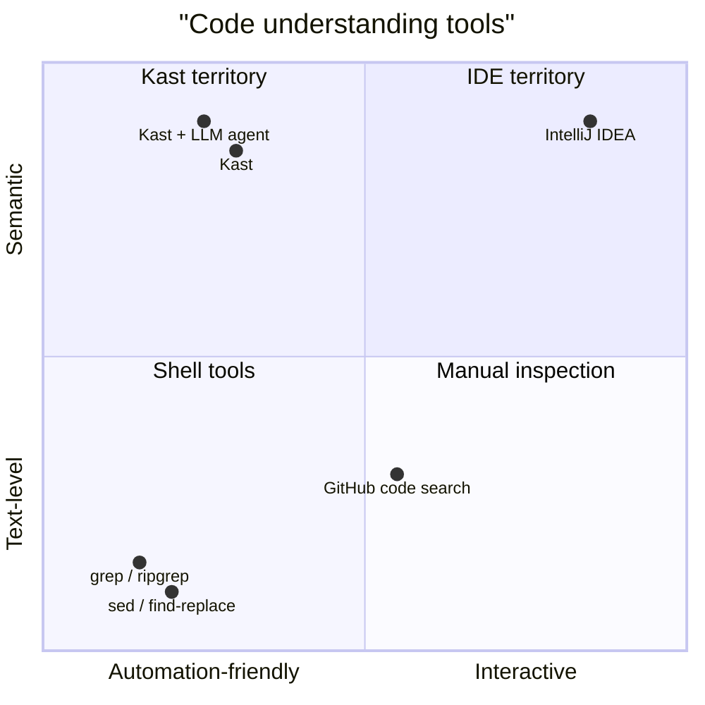

Kast sits between two tools Kotlin teams already use. Shell tools are easy to
script, but they only understand text. IntelliJ IDEA understands symbols and
refactorings, but it assumes an interactive IDE session. Kast gives you
automation-friendly, IDE-grade code intelligence between those two worlds.

## The problem with text search

Text search is excellent at finding bytes quickly across a repository. It is
not built to answer semantic questions about a Kotlin program. Real
maintenance work depends on symbol identity, caller relationships, and
refactoring safety, which is where plain string matching stops being enough.

### Text search finds names, Kast finds symbols

`grep` and `ripgrep` can tell you where a name appears. They can't tell you
which declaration that name resolves to when the workspace has overloads,
members with the same simple name, local variables, or multiple packages with
similarly named types. Kast resolves the symbol at a specific location and
returns the exact declaration identity, so you can ask about the symbol you
meant instead of every matching token.

### Text search cannot follow the call graph

Text search can show you files that mention a function name, but it can't tell
you which mentions are actual callers, which ones resolve to a different
symbol, or which edges leave the workspace entirely. Kast can walk incoming
callers or outgoing callees from a resolved declaration and return a bounded
tree with stats and truncation metadata. You get structural evidence, not just
matching lines.

### Text search cannot plan a safe rename

Find-and-replace rewrites bytes without knowing whether each match refers to
the same symbol. It also cannot tell you whether a file changed after you
planned the edit. Kast builds a rename plan from a resolved symbol, returns
the exact edits it would make, and pairs them with SHA-256 file hashes so you
can detect conflicts before applying anything to disk.

### Text search cannot search by symbol kind

Text search treats every matching line equally. It cannot distinguish a class
named `Config` from a property named `config` from a local variable named
`config`. Kast's workspace symbol search lets you filter by kind, match with
regex, and get results that include the symbol's declaration metadata. When
you need "all classes whose name ends with Service," Kast gives you a typed
answer instead of a line list.

The difference is easiest to see side by side.

| Tool | Understands symbols | Finds symbols by name | Follows the call graph | Plans safe renames | Fits automation | Best fit |
| --- | --- | --- | --- | --- | --- | --- |
| `grep` / `ripgrep` | No | Text only | No | No | Yes | Fast text discovery |
| **Kast** | Yes | Yes, semantic | Yes, with explicit bounds | Yes | Yes | Semantic analysis in scripts, CI, and agents |
| IntelliJ IDEA | Yes | Yes | Yes | Yes | Limited | Interactive exploration and refactoring |

## Why this matters for LLM agents

LLM agents can already search files and rewrite text. What they usually lack
is a semantic runtime that can identify the exact symbol under discussion,
trace real callers and callees, and reject stale edit plans instead of
guessing. Kast gives an agent machine-readable answers that line up with
Kotlin semantics, not just string matches.

That changes what an agent can do safely:

- Resolve a stable symbol identity before it summarizes usage.
- Follow a bounded call graph and report where the result is partial.
- Plan edits against the right declaration instead of every matching name.
- Find declarations by name across the workspace without relying on text
  search heuristics.
- Apply prepared edits with hash-based conflict detection instead of blind
  text replacement.

## Next steps

If you want to see the capability surface next, move to the questions Kast can
answer or the high-level architecture.

- [What you can do](what-you-can-do.md)
- [How Kast works](how-it-works.md)
- [Get started](get-started.md)
